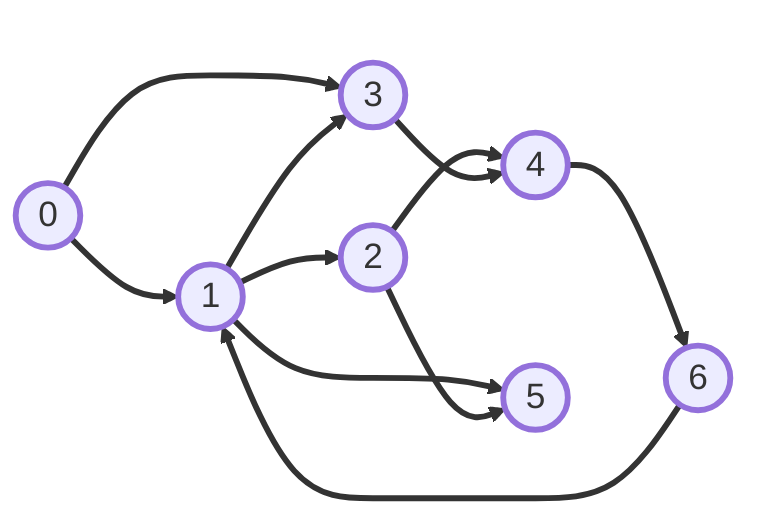

# BFS Traversal in Java

This demonstrates **Breadth-First Search (BFS)** traversal on a directed graph represented by an **adjacency matrix**.

---

## 📖 What is BFS?

Breadth-First Search (BFS) is a graph traversal algorithm that explores vertices **level by level**:

* It starts from a source node.
* Visits all its neighbors before moving to the next level of nodes.
* Uses a **queue** to manage the order of exploration.
* Ensures each node is visited exactly once using a **visited array**.

---

## 🗂 Code Overview

### 1. `addEdgeDUG`

```java
public static void addEdgeDUG(int[][] adjMatrix, int src, int dest) {
    adjMatrix[src][dest] = 1;
}
```

**Description:** Adds a **directed edge** from `src` to `dest` in the adjacency matrix by setting the value at `[src][dest]` to 1.

---

### 2. `adjMatrixBuilder`

```java
public static int[][] adjMatrixBuilder(int vertices, int[][] edges){
    int[][] adjMatrix = new int[vertices][vertices];
    for (int i = 0; i < edges.length; i++) {
        addEdgeDUG(adjMatrix, edges[i][0], edges[i][1]);
    }
    return adjMatrix;
}
```

**Description:** Builds the adjacency matrix for the graph. It initializes a `vertices x vertices` matrix with 0s and fills in edges using the `addEdgeDUG` function.

---

### 3. `bfs`

```java
public static void bfs(int[][] graph, int source){
    int[] visited = new int[graph.length];
    queue q = new queue();
    q.enqueue(source);
    visited[source] = 1;
    while (q.isEmpty() != true) {
        int u = q.dequeue();
        System.out.println(u);
        for (int i = 0; i < graph[u].length; i++) {
            if (graph[u][i] != 0) {
                if (visited[i] != 1) {
                    q.enqueue(i);
                    visited[i] = 1;
                }
            }
        }
    }
}
```

**Description:** Performs **Breadth-First Search** starting from a given source node. It uses a queue to ensure nodes are explored level by level, and a `visited[]` array to prevent revisits.

---

### 4. `main`

```java
public static void main(String[] args) {
    int totalVertice = 7;
    int[][] edges = {{ 0, 1 }, { 0, 3 }, { 1, 2 }, { 1, 3 }, { 1, 5 }, { 2, 4 }, { 2, 5 }, { 3, 4 }, { 4, 6 }, { 6, 1 }};
    int[][] adjMatrix = adjMatrixBuilder(totalVertice, edges);
    bfs(adjMatrix, 0);
}
```

**Description:** Defines the graph with 7 vertices and 10 directed edges. Builds the adjacency matrix and calls `bfs` to perform traversal starting from vertex `0`.

---

## 🔗 Graph Structure

Here’s the graph we are traversing (7 vertices, directed edges):



---

## ⚙️ BFS Traversal Process

* Start at node `0`.
* Explore its neighbors (`1` and `3`).
* Next, process `1`, then add its neighbors (`2`, `5`).
* Process `3`, then add its neighbor (`4`).
* When `4` is processed, discover `6`.
* Node `6` has an edge back to `1`, but `1` is already visited, so it is skipped (prevents cycling).
* Continue until the queue is empty.

---

## 🖥 Expected Output

Running the program will print the BFS traversal order starting from node `0`:

```
0
1
3
2
5
4
6
```

---

## 📝 Notes

* This traversal order is **level-order**:

  * First: `0`
  * Second level: `1, 3`
  * Third level: `2, 5, 4`
  * Finally: `6`
* The edge `6 → 1` introduces a **cycle**, but the `visited[]` array prevents revisiting node `1`.
* Order among nodes at the same level may vary slightly depending on **edge insertion order**.

---
