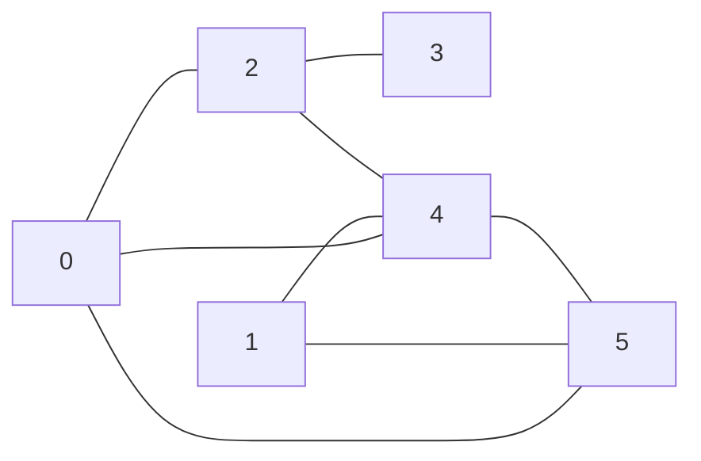
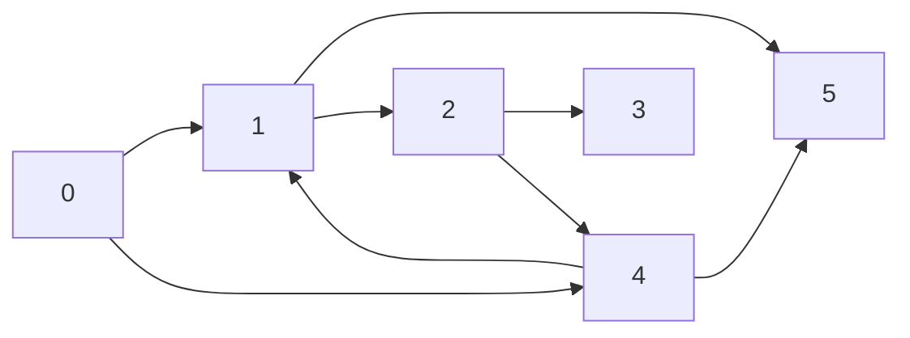
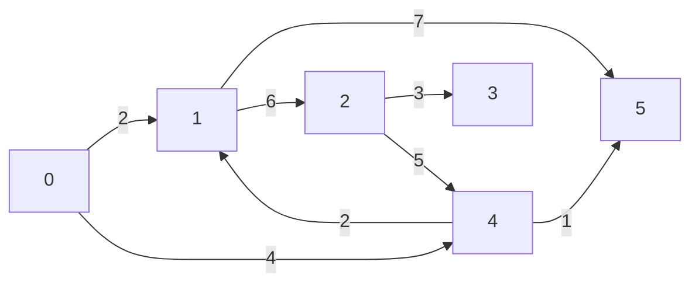

# Undirected-Unweighted-Graph [UUG]

```mermaid
graph LR;
    0 --- 2;
    0 --- 4;
    0 --- 5;
    1 --- 4;
    1 --- 5;
    2 --- 3;
    2 --- 4;
    4 --- 5;
``` 
---

# Directed-Unweighted-Graph [DUG]

```mermaid
graph LR;
    0 --> 1;
    0 --> 4;
    1 --> 5;
    2 --> 3;
    2 --> 4;
    4 --> 5;
    1 --> 2;
    4 --> 1;
```
---
# Directed-Wighted-Graph [DWG]

```mermaid
graph LR;
    0 -->|2| 1;
    0 -->|4| 4;
    1 -->|7| 5;
    2 -->|3| 3;
    2 -->|5| 4;
    4 -->|1| 5;
    1 -->|6| 2;
    4 -->|2| 1;

```

