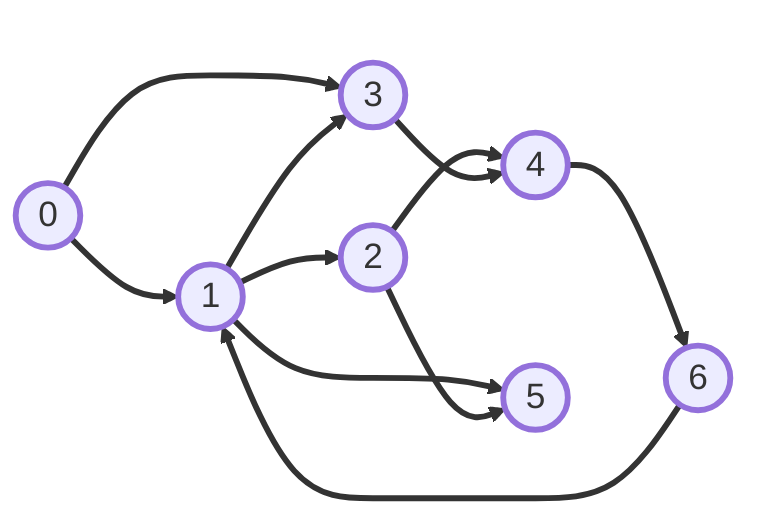

# DFS Traversal in Python

This demonstrates **Depth-First Search (DFS)** on a directed graph represented by an **adjacency list** using a custom linked-list node (`DU_Edge`) and a custom `Stack`.

---

## 🔍 What is DFS?

Depth-First Search explores as far as possible along one branch **before backtracking**. In the iterative variant here, a **stack (LIFO)** drives the traversal order. We use a `visited` array to avoid revisiting nodes and getting stuck in cycles.

---

## 🗂 Code Overview

### 1) `adjListBuilder`

Builds an adjacency list from the edge list using `DUG_AdjList.addEdgeDUG` (which prepends each new edge to the head of the list for its source).

```python
from DUG_AdjList import addEdgeDUG

def adjListBuilder(vertex, edges):
    adjList = [None] * vertex
    for i in range(len(edges)):
        addEdgeDUG(adjList, edges[i][0], edges[i][1])
    return adjList
```

**Notes**

* `addEdgeDUG` inserts at the head, so for each source vertex, **later edges appear first** in its adjacency list.

---

### 2) `dfsTraversal`

Iterative DFS using the custom `Stack` of vertex indices. We mark nodes **when pushing** so each vertex is pushed at most once (useful with cycles like `6 → 1`).

```python
from stack import Stack

def dfsTraversal(graph, source):
    visited = [0] * len(graph)
    stck = Stack()
    stck.push(source)
    visited[source] = 1

    while stck.isEmpty() != True:
        u = stck.pop()
        print(u)

        v = graph[u]
        while v is not None:
            if visited[v.vertex] != 1:
                stck.push(v.vertex)
                visited[v.vertex] = 1
            v = v.next
```

**Alternative**: If you prefer to mark **when popping**, move the `visited[...] = 1` to right after `pop()` and guard against repeated pushes.

---

### 3) `__main__`

Defines the graph, builds the adjacency list, and runs DFS from source `0`.

```python
if __name__ == "__main__":
    totalVertex = 7  # vertices 0..6
    edges = [
        [0, 1], [0, 3], [1, 2], [1, 3], [1, 5],
        [2, 4], [2, 5], [3, 4], [4, 6], [6, 1],
    ]

    adjList = adjListBuilder(totalVertex, edges)
    dfsTraversal(adjList, 0)
```

> This uses your `DU_Edge` and `DUG_AdjList` helpers and your custom `Stack` implementation storing vertex indices.

---

## 🔗 Graph Structure

Directed graph used in this example (same as the code above):



* Notice the **cycle** `6 → 1` (and paths from `1` to `6` via `1 → 2 → 4 → 6`). The `visited` array prevents infinite loops.

---

## ⚙️ DFS Traversal Process (Iterative, mark-on-push)

Starting at `0`:

1. Visit `0`; push its neighbors (from adjacency list order) → `1` and `3` (due to list-prepend + stack LIFO, `1` is popped before `3`).
2. Pop `1`; push unvisited neighbors → `2`, `5` (neighbor `3` is already visited or will be, depending on timing).
3. Pop `2`; push `4` (skip `5` if already visited).
4. Pop `4`; push `6`.
5. Pop `6`; neighbor `1` is already visited → skip.
6. Pop `5` (no neighbors).
7. Pop `3`; neighbor `4` already visited → skip.

---

## 🖥 Expected Output

With the code as written (neighbors are **prepended** and we **mark on push**), the DFS print order from source `0` is:

```
0
1
2
4
6
5
3
```

> Traversal order can change if you: (a) change the edge insertion order, (b) switch to **mark-on-pop**, or (c) reverse neighbor iteration.


---

## 📝 Notes

* **Adjacency list order matters**: `addEdgeDUG` prepends, so the most recently added edge for a source is considered first.
* **Stack behavior**: Pushing neighbors in order `a, b, c` means you will process `c` first.
* **Cycles**: `visited` is crucial to avoid revisits (`6 → 1`).
* This DFS is **preorder-like**: a vertex is printed when it is popped; visited marking is done on push to prevent duplicate pushes.
