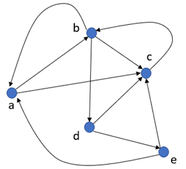
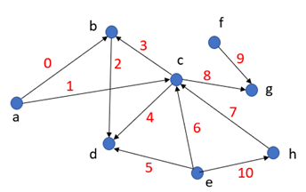

# Chapter 7 - Graphs


## 7.1 Introduction


| Figure 1                   | Figure 2                            |
| -------------------------- | ----------------------------------- |
| A graph for a road network | A graph showing a Protein Structure |
|  |  |


| Figure 3           | Figure 4                       |
| ------------------ | ------------------------------ |
| A Facebook network | Graph visualizing the internet |
|  |  |

So far, we have learned about data structures that can store linear sequences (e.g., arrays, lists, stack, queues) and data structures that can represent non-linear hierarchical relationships (i.e., different types of trees).

What can be the most generic data structures that can represent arbitrary relationships among entities without any ordering restrictions? The answer is **graphs**.

Graphs are the most versatile data structure that can represent any relationship network among a collection of objects. For example, we can use graphs to represent:

* Road networks
* The internet
* Structure of molecules and proteins
* Social networks
* Evolutionary relationships among species
* Geographic regions

In fact, a single graph can capture multiple types of entities and relationships. Whenever we have a collection of entities and need to model their interactions and relations as a network, we can use graphs.

Therefore, being able to store and use graphs in our programs is absolutely essential. Graphs are so important in computer science that **graph theory and graph algorithms are considered core computer science courses**, and many books have been written on them.

Even drawing a graph for visualization and human analysis is a vast topic taught as a separate course in many universities!

Here, we will only learn the basics related to graphs:

* Fundamental terminologies
* Common graph data structure representations
* Graph traversal techniques

**Image Sources:**

* [Road Network Graph](https://www.researchgate.net/figure/An-example-of-road-network-extraction-and-graph-representation_fig12_279263325)
* [Protein Structure Graph](https://benthamopen.com/contents/supplementary-material/TOBIOIJ-5-53_SD1.pdf)
* [Internet Graph Visualization](https://www.researchgate.net/figure/2-A-graph-visualisation-of-the-topology-of-network-connections-of-the-core-of-the_fig2_239550496)
* [Facebook Network Graph](https://www.researchgate.net/publication/340347681_A_Study_on_Graph_Theory_Properties_of_On-line_Social_Networks)

---

## 7.2 Graph Terminologies

A **graph G** is represented as:

$$
G = (V, E)
$$

Where:

* **V** = set of vertices (nodes) representing entities
* **E** = set of edges (links) representing relationships

### Directed vs. Undirected Graphs

* **Undirected Graph:** Edge (a, b) = Edge (b, a)
* **Directed Graph:** Edge (a, b) means from **a → b**, not the other way.

### Degree of a Vertex

* **Undirected Graph:** Degree = number of edges of a vertex.
* **Directed Graph:**

  * **In-degree:** number of incoming edges.
  * **Out-degree:** number of outgoing edges.

### Path

A **path** is a sequence of edges connecting two vertices.
Example: (a,b), (b,c), (c,e), (e,d) forms a path between **a** and **d**.

* **Disconnected Graph:** If no path exists between vertices.
* **Component:** A subset of vertices mutually reachable in a disconnected graph.

### Distance

The **distance** between two vertices is the number of edges in the shortest path.

### Cycle

A **cycle** is a path that starts and ends at the same vertex.
Example: (b,d), (d,e), (e,c), (c,b).

### Weighted Graphs

Graphs may assign **weights** to vertices and/or edges:

* Vertex weight → importance of the entity
* Edge weight → cost or strength of relationship

Example: In road networks,

* Vertices = junctions,
* Edges = road segments,
* Edge weight = distance or cost.

| Figure 5                                                              | Figure 6                                                              |
| --------------------------------------------------------------------- | --------------------------------------------------------------------- |
|  |  |
| Weighted undirected graph                                             | Weighted directed graph                                               |

### Sparse vs. Dense Graphs

* **Sparse Graph:** Few edges relative to vertices.
* **Dense Graph:** Many edges relative to vertices.

---

## 7.3 Graph Representations

Graphs can be represented in different ways:

1. **Adjacency List Representation**
2. **Adjacency Matrix Representation**
3. **Incidence Matrix Representation**

---

### 7.3.1 Adjacency List Representation

* Each vertex is an index in an array.
* Each entry holds a linked list of adjacent vertices.

#### Example:

* Undirected graph (Figure 5)
* Directed graph (Figure 6)

For **weighted graphs**, define an `Edge` class:

```java
Class Edge {
    int ep1;
    int ep2;
    int weight;
}
```

#### Space Complexity:

$$
O(N + M)
$$

Where:

* N = vertices
* M = edges

---

### 7.3.2 Adjacency Matrix Representation

* Uses an **N × N** matrix.
* **Undirected graphs** → symmetric matrix.
* **Directed graphs** → not symmetric.
* **Weighted graphs** → store weight instead of 1.

| Figure 7                                                                               | Figure 8                                                                             | Figure 9                                                                                      |
| -------------------------------------------------------------------------------------- | ------------------------------------------------------------------------------------ | --------------------------------------------------------------------------------------------- |
|  Undirected Graph |  Directed Graph |  Weighted Directed Graph |

#### Space Complexity:

$$
O(N^2)
$$

---

### 7.3.3 Incidence Matrix Representation

* Uses an **M × N** matrix (M edges, N vertices).
* Rows = edges, Columns = vertices.
* Undirected graph: row has two `1`s.
* Directed graph: `1` for source, `-1` for destination.

| Figure 10                                                                             | Figure 11                                                                            |
| ------------------------------------------------------------------------------------- | ------------------------------------------------------------------------------------ |
|   |   |
| Undirected Graph | Directed Graph |

#### Space Complexity:

$$
O(M \times N)
$$

---

### Practice Problems

1. Count edges from adjacency matrix representation.
2. Convert adjacency matrix to adjacency list.
3. Solve for all three representations:

   * (a) Vertex with maximum degree (unweighted graph).
   * (b) Vertex with max sum of edge weights (weighted graph).
   * (c) Repeat (a) & (b) for directed weighted graphs (outgoing edges only).

---

## 7.4 Graph Traversals

To solve problems using graphs, traversal is key.

### Challenges

* Graphs may contain **cycles** → infinite recursion possible.
* Graphs may be **disconnected** → traversal may cover only one component.


### General Traversal Algorithm (Pseudo-code)

```pseudo
Algorithm Traverse-Graph(G)
  visited := new List
  store := new Queue/Stack
  V := G.vertices
  start := V[0]

  while (start != null) {
      store.insert(start)
      visited.insert(start)

      while (store.isEmpty() == FALSE) {
          u := store.removeNext()
          // computation on u
          edges := u.edges
          foreach (e in edges) {
              v := other endpoint of e
              if (visited.contains(v) == FALSE) {
                  visited.append(v)
                  store.insert(v)
              }
          }
      }

      start = null
      foreach (v in V) {
          if (visited.contains(v) == FALSE) {
              start := v
              break
          }
      }
  }
```

---

### 7.4.2 Breadth-First and Depth-First Traversals

* **Breadth-First Traversal (BFS):** Uses a **queue**.

| Figure 12                                                         | Figure 13                                                             |
| ----------------------------------------------------------------- | --------------------------------------------------------------------- |
|  |  |
| BFS traversal illustration                                        | BFS step expansion                                                    |

* **Depth-First Traversal (DFS):** Uses a **stack**.

| Figure 14                                                           |
| ------------------------------------------------------------------- |
|  |
| DFS Traversal                                                       |

---

### Time Complexity

* Traversal visits each vertex once and checks all edges.
* For **undirected graphs**, each edge is evaluated twice.
* Steps = `n + 2m`.
* With list check → `O(m + n²)`.
* With Boolean array → `O(n + m)`.

---

