# 6.5 Heap Data Structure

A **heap** is an abstract data type (ADT) used for storing values. It is
visually represented as a special **binary** **tree**, but its
underlying data structure is an **array**. Arrays enable **random**
**access** via indices, making parent and child lookups straightforward.
The tree structure makes heaps intuitive to visualise and manipulate
with pen and paper, which we will explore further.

Let’s break down this **“special tree”**:

A heap must be a **complete** **binary** **tree** and must satisfy the
**heap property**.

In the previous chapter, we studied **queues**, which follow the
**FIFO** **(First** **In,** **First** **Out)** principle. If we want to
implement a **priority** **queue**—which maintains the FIFO order based
on priority—a **heap** is the ideal underlying data structure.

**6.5.1 Heap Property**

A heap is a specialised binary tree that satisfies the heap property and
can be of two types: max-heap or min-heap. Unless otherwise specified, a
heap refers to a max-heap in this course.

> ● In a max-heap, for every node _i_ _\>_ _1_, the value of the parent
> node satisfies: A\[Parent(i)\] ≥ A\[i\].
>
> The maximum element is at the root.
>
> ● In a min-heap, for every node _i_ _\>_ _1_, the value of the parent
> node satisfies: A\[Parent(i)\] ≤ A\[i\].
>
> The minimum element is at the root.

A heap can be either a max-heap or a min-heap, but not both
simultaneously.

**Heap** **as** **an** **array:**

A heap is a complete binary tree that can be efficiently represented
using an array, eliminating the need to store edges explicitly.

**Heap Index Relationships:**

>●For a node at index *i*:
>- Parent: `⌊i/2⌋` (floor division)
>- Left child: `2i`
>- Right child: `2i + 1`

Similar to binary search tree (BST) conventions, heap indexing starts
at 1. While the tree structure aids in visualisation, the underlying
data structure used in programming is a simple array. This array-based
representation allows constant-time access to parent and child nodes.


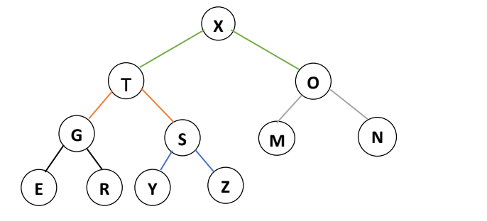

> The above tree is a heap. Below is the array representation of the
> above heap.

| 1   | 2   | 3   | 4   | 5   | 6   | 7   | 8   | 9   | 10  | 11  | 
| --- | --- | --- | --- | --- | --- | --- | --- | --- | --- | --- | 
| X   | T   | O   | G   | S   | M   | N   | E   | R   | Y   | Z   |

**Benefits of** **Using** **an** **Array** **for** **Heap**
**Instead** **of** **a** **Linked** **List**

Arrays provide random access to elements via indices, allowing direct
access to any element by its index. This makes finding a parent or its
children straightforward.

In contrast, a linked list is sequential. To locate a specific element,
you must traverse the list node by node, as it does not support random
access like arrays do. Additionally, representing a tree using linked
lists requires three references per node: one each for the parent, left
child, and right child.

**6.5.2 Operations on Heap**

> 1\. max-heapify(A, i): Ensures the max-heap property of the array A,
> starting at node i. Also known as the “sink” operation, as it sinks
> smaller elements down the tree.
>
> 2\. heap-increase-key(A, i, key): Increases the value of the element
> at node i to key and restores the max-heap property of A by moving
> larger elements upward. Also known as the “swim” operation, as it
> moves larger elements up the tree.
>
> 3\. max-heap-insert(A, key): Inserts key into the heap A, maintaining
> the max-heap property. 4. get-maximum(A): Returns the element with the
> largest key in the heap.
>
> 5\. heap-extract-max(A): Extracts and returns the largest element from
> the heap A, maintaining the heap property.
>
> 6\. build-max-heap(A): Builds a max-heap from an unordered array A. 7.
> Heapsort (A): Sorts the elements in array A using heap operations.

**6.5.2.1 max-heapify() / Sink():**

This operation ensures the max-heap property for the subtree rooted at
node i. It is also known as the "sink" operation because it moves
smaller elements down the tree. The precondition for this operation is
that the subtrees rooted at the left and right children of i are already 
max-heaps. After executing max-heapify(A, i), the subtree rooted at i
will satisfy the max-heap property, where the value at i is greater than or equal to its children,
and both subtrees remain max-heaps.

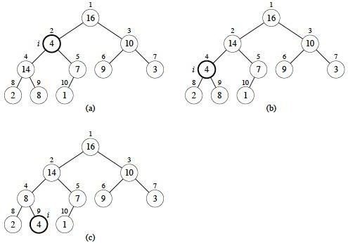


Note: Image from Cormen, Leiserson, Rivest, Stein. _Introduction_ _to_
_Algorithms_, 3rd edition, MIT Press, 2009.

In the figure above, (a) shows the result of calling max_heapify() on
index 2, which contains the value 4. Since 4 is smaller than both of its
children, we compare the values of the children. The largest child is
14, located at index 4. Therefore, in (b), the values at index 2 and
index 4 are swapped.

Next, max_heapify() is called on index 4, where the value is now 4.
Since 4 is smaller than its right child at index 9, which has the value
8, the values at index 4 and index 9 are swapped. This is shown in (c).

**Time** **Complexity:** The operation has a time complexity of O(log
n), as it may require traversing the height of the tree in the worst
case.

**Pseudocode:**
```python
function max-heapify(heap, index):
    size = size of heap
    largest = index
    left = 2 * index + 1
    right = 2 * index + 2
    
    if left < size and heap[left] > heap[largest]:
        largest = left
    
    if right < size and heap[right] > heap[largest]:
        largest = right
    
    if largest != index:
        swap heap[index] with heap[largest]
        max-heapify(heap, largest)
```
**6.5.2.2** **Heap_Increase_Key()** **/** **swim():**

The heap-increase-key(A, i, key) operation increases the value of the
element at index i to key and restores the max-heap property by moving
the updated element upward through the heap. This process, known as the
"swim" operation, repeatedly compares the updated node (n) with its
parent and swaps them if the parent is smaller. This continues until n
is no longer greater than its parent or it becomes the root. The
operation ensures that the max-heap structure is maintained after
increasing a key.

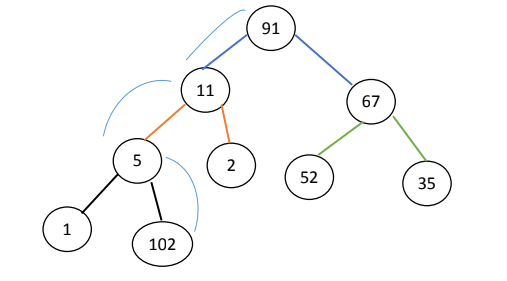

After the swim() operation, the Heap will look like this:

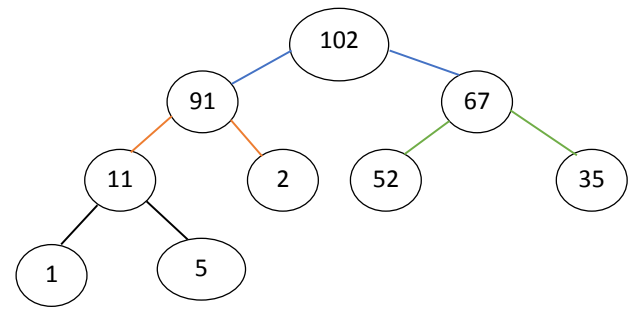

**Time** **Complexity:** The best-case time complexity of
heap-increase-key is O(1) when the new key is already in the correct
position. The worst case is O(log n), occurring when the updated node
must "swim" up to the root. Thus, the overall time complexity is
O(log n).

**6.5.2.3** **max-heap-insert()**

In a max-heap, insertion is performed by placing the new element at the
next available position—i.e., at the end of the array (heap-size + 1),
maintaining the complete binary tree structure. Initially, a placeholder
value (e.g., -∞) is inserted, and then the actual key is set using
heap-increase-key(), which adjusts the position of the new key by moving
it upward (swim) until the max-heap property is restored. This ensures
that the largest element remains at the root.

| # | Description | Heap Visualization |
|------|-------------|--------------------|
| 1 | Original heap creation from the given array `[15, 13, 9, 5, 12, 8, 7, 4, 0, 6, 2, 1, NONE]` | 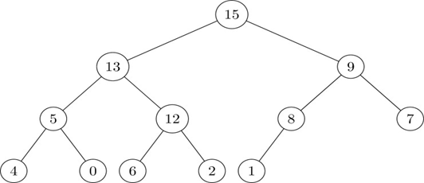 |
| 2 | `MAX-HEAP-INSERT(A,10)` is called - append a node assigned value `NONE` | 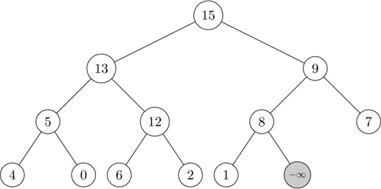 |
| 3 | Update the key value of the new node to 10 | 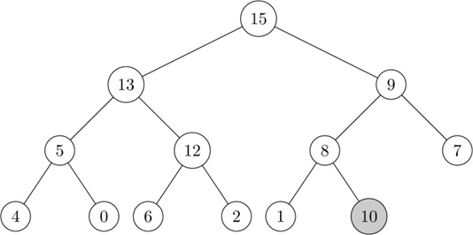 |
| 4 | Since the parent key (8) is smaller than 10, the nodes are swapped (Swim up) | 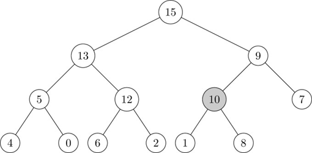 |
| 5 | Since the parent key (9) is smaller than 10, the nodes are swapped (Swim up). Final heap after insertion. | 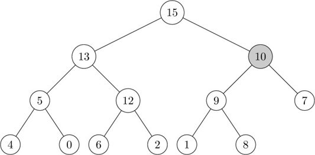 |


**Pseudocode:**
```python
function heap-increase-key(A, i, key):
    if key < A[i]:
        error "new key is smaller than current key"
    A[i] = key
    while i > 1 and A[parent(i)] < A[i]:
        exchange A[i] with A[parent(i)]
        i = parent(i)

function parent(index):
    return index // 2

function max-heap-insert(A, key):
    heap-size[A] = heap-size[A] + 1
    A[heap-size[A]] = -∞
    heap-increase-key(A, heap-size[A], key)
```

**6.5.2.4 get_maximum()**

Returns the element with the largest key from the max-heap A.

**Time** **Complexity:** O(1) (The maximum element is always at the
root: A\[1\]).

**6.5.2.5 Heap-extract-max** **()**

In a heap, you cannot delete an element randomly. Deletion is done by
replacing the root with the last element in the heap, which may break
the heap property. The heap will need to be restored by "sinking" the
new root to its correct position.

**Initial** **Max** **Heap:** **\[30,** **20,** **15,** **7,** **10,**
**5\]**

```
     30
     /\
    /  \
   /    \
  20    15
 / \    /
7  10  5
```


**Step** **1:** **Swap** **root** **(30)** **with** **last** **element**
**(5),** **then** **delete** **the** **last** **element.**

After swap: \[5, 20, 15, 7, 10\] (heapify to follow)

```
      5
     / \
    /   \
   20   15
  / \   
 7  10  
```

**Step** **2:** **Call** **max-heapify** **from** **index** **1**
**(heapify** **down).**


After heapify:

```
      20
     / \
    /   \
   10   15
  / \   
 7   5  
```

Final Heap: \[20, 10, 15, 7, 5\]

**Time** **Complexity:** heap-extract-max() has a time complexity of
O(log n) due to the max_heapify() operation, which may traverse the
height of the tree in the worst case.

**Pseudocode:**
```python
function get_maximum(A):
    if heap is empty:
        return error
    return A[1]

function heap_extract_max(heap):
    if heap is empty:
        return error
    max_value = heap[1]
    swap heap[1] with heap[last index]
    remove last element from heap
    decrease heap size
    max_heapify(heap, 1)
    return max_value
```
**6.5.2.6 build-max-heap()**

Build-Max-Heap(A) is used to convert an unsorted array into a valid
max-heap, where each parent node is greater than or equal to its
children. Starting with an array A\[1..n\], the algorithm applies the
max-heapify operation from the last internal node up to the root. This
ensures that each subtree satisfies the max-heap property.

**Pseudocode:**
```python
function buildMaxHeap(array):
    for i from ⌊length(array)/2⌋ down to 1:
        maxHeapify(array, i)
```


| Step | Description | Heap Visualization |
|------|-------------|--------------------|
| 1 | The heap has a length of 11, so the first internal node is at index ⌊11/2⌋ = 5. At index 5, the value is 16, which is greater than its child at index 10 (value 7). Therefore, no swap is needed. | 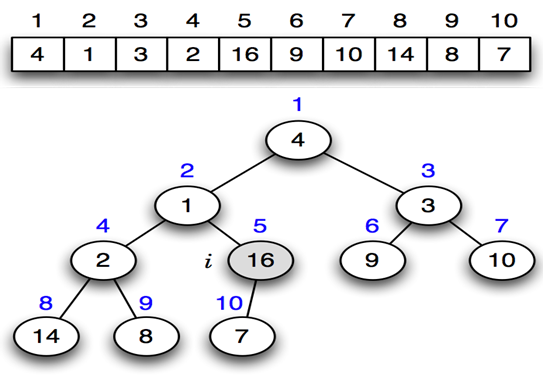 |
| 2 | At index 4, the value is 2, which is smaller than both its children. The largest child, 14, is at index 8, so a swap occurs between 2 and 14. | 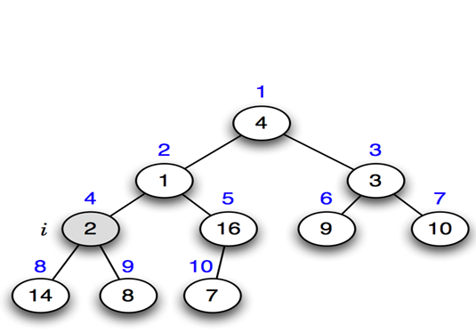 |
| 3 | At index 3, the value is 3, which is smaller than both its children. The largest child, 10, is at index 7, so a swap occurs between 3 and 10. | 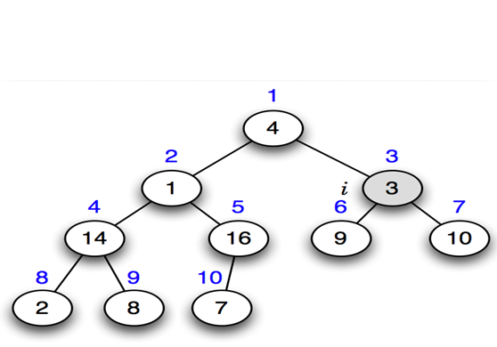 |
| 4 | At index 2, the value is 1, smaller than both its children. The largest child, 16, is at index 5, so a swap occurs between 1 and 16. At index 5, the value is 1, which is smaller than its left child (7 at index 10), so a swap occurs between 1 and 7. | 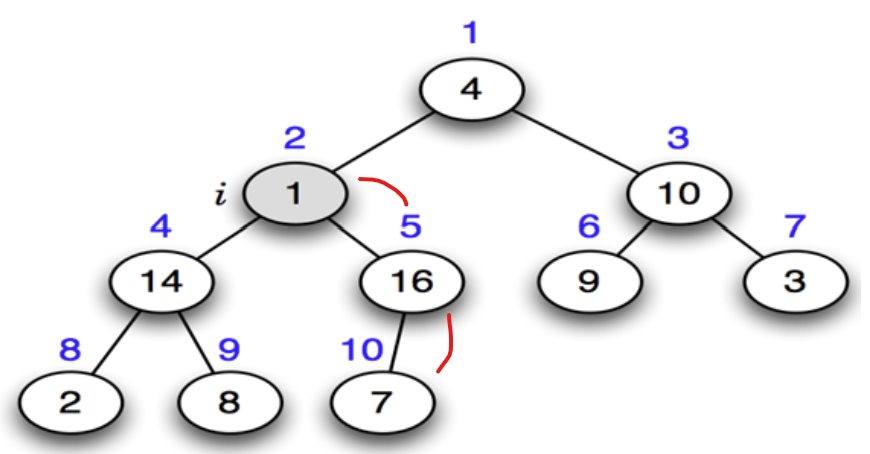 |
| 5 | At index 1, the value is 4, smaller than both its children. The largest child, 16, is at index 2, so a swap occurs between 4 and 16. At index 2, the value is 4, smaller than both its children (14 and 7). The largest child, 14, is at index 4, so a swap occurs between 4 and 14. At index 4, the value is 4, smaller than its right child (8 at index 9), so a swap occurs between 4 and 8. | 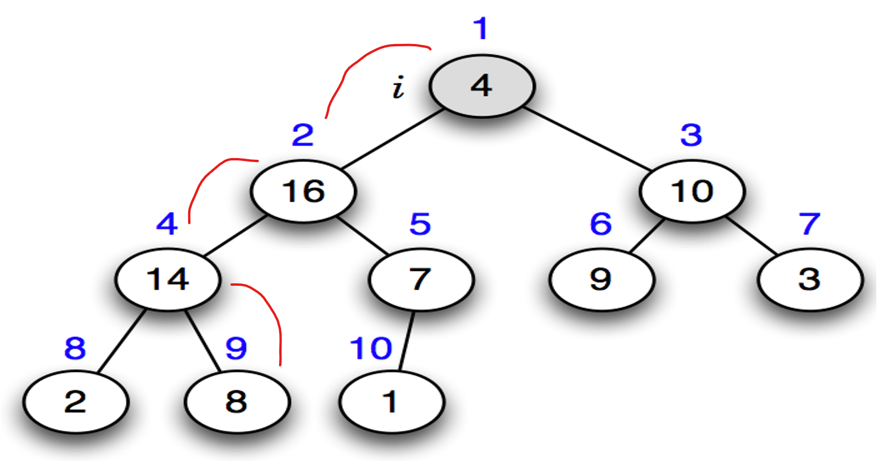 |
| 6 | The final state of the tree is achieved after calling max-heapify on all internal nodes, from the last internal node to the root. | 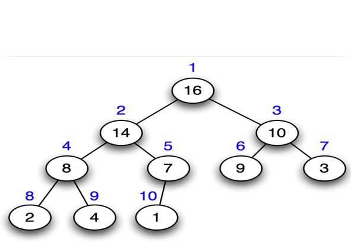 |

**Time** **complexity:** While max-heapify runs in O(log n) and is
called up to n/2 times, the actual runtime of build-max-heap(A) is not
O(n log n), but O(n). This is because most heapify operations occur on
smaller subtrees near the bottom of the heap, which require less work.
When analyzed more precisely using the aggregate method, the total cost
sums to O(n).

**6.5.2.7** **Heap** **Sort**

Heapsort is an in-place sorting algorithm that sorts an array A\[1..n\]
in ascending order. It first builds a max-heap with the largest element
at the root (A\[1\]). The root is then swapped with the last element
(A\[n\]), and the heap size is reduced by 1. Max-heapify is called on
the root to restore the heap property. This process repeats,
progressively moving the largest elements to the end until the array is
fully sorted.

**Differences** **in** **Sorting** **Order**

>Max Heap: Sorts in ascending order by repeatedly moving the largest elements to the end. 
>
>Min Heap: Sorts in descending order by repeatedly moving the smallest elements to the end.

| **Heap Type** | **Sorting Order** | **Key Element Moved** | **Re-Heapify Operation** |
|--------------|------------------|----------------------|--------------------------|
| Max Heap     | Ascending        | Largest to End       | Maintain Max Heap, calls max-heapify |
| Min Heap     | Descending       | Smallest to End      | Maintain Min Heap, calls min-heapify |

**Time** **complexity:** Heapsort operates in-place, meaning it sorts
without using extra space for another array, modifying only the input
array. Its worst-case time complexity is O(n log n).

**Heapsort Simuation Example 01:**

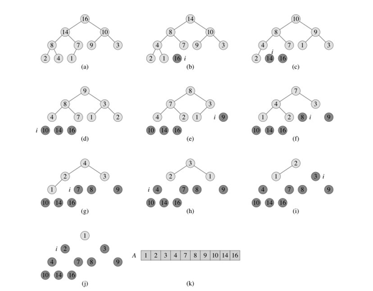

Note: Image from Cormen, Leiserson, Rivest, Stein. _Introduction_ _to_
_Algorithms_, 3rd edition, MIT Press, 2009.


**Heapsort Simuation Example 02:**

**Initial Array:** `[30, 20, 15, 7, 10, 5]`

**Initial Heap:**
```
      30
     /  \
   20    15
  / \   /
 7 10 5
```

---

**Step 1: Swap 30 and 5 → `[5, 20, 15, 7, 10, 30]`, then heapify**
```
      20
     /  \
   10    15
  / \
 7   5
```

---

**Step 2: Swap 20 and 5 → `[5, 10, 15, 7, 20, 30]`, then heapify**
```
      15
     /  \
   10    5
  /
7
```

---

**Step 3: Swap 15 and 7 → `[7, 10, 5, 15, 20, 30]`, then heapify**
```
      10
     /  \
    7    5
```

---

**Step 4: Swap 10 and 5 → `[5, 7, 10, 15, 20, 30]`, then heapify**
```
      7
     /
    5
```

---

**Step 5: Swap 7 and 5 → Final sorted array: `[5, 7, 10, 15, 20, 30]`**

**Pseudocode:**
```python
function heapsort(A):
    build_max_heap(A)
    for i = length[A] downto 2:
        exchange A[1] with A[i]
        heap_size[A] = heap_size[A] - 1
        max_heapify(A, 1)
```


