Appendix A - Recursion

A.1 Introduction

Recursive function is no different than a normal function. The
motivation to use recursive functions vs non-recursive is that the
recursive solutions are usually easier to read and comprehend. Certain
applications, like **tree** **search,** **directory** **traversing**
etc. are very well suited for recursion. The drawbacks are that you may
need a little time to learn how to use it and you may need a little
longer to debug errors. It takes more processing time and more memory.
But there can be cases when recursion is the best way.

For example if you need to get the full tree of a directory and store it
somewhere. You can write loops but it will be very complicated. And it
will be very simple if you use recursion. You'll only get files of root
directory, store them and call the same function for each of the
subdirectories in root.

Recursion is a way of thinking about problems, and a method for solving
problems. The basic idea behind recursion is the following: it's a
method that solves a problem by solving smaller (in size) versions of
the same problem by breaking it down into smaller subproblems. Recursion
is very closely related to mathematical induction.

We'll start with recursive definitions, which will lay the groundwork
for recursive programming. We'll then look at a few prototypical
examples of using recursion to solve problems. We'll finish by looking
at problems and issues with recursion.

A.2 Recursive Definitions

We'll start thinking recursively with a few recursive definitions: 1.
Factorial

2\. Fibonacci numbers

**A.2.1** **Factorial:**

The factorial of a non-negative integer n is defined to be the product
of all positive integers less than or equal to n. For example, 5! = 5 \*
4 \* 3 \* 2 \* 1 = 120.

> 1! = 1
>
> 2! = 2 \* 1
>
> 3! = 3 \* 2 \* 1
>
> 4! = 4 \* 3 \* 2 \* 1
>
> 5! = 5 \* 4 \* 3 \* 2 \* 1 …..
>
> ….. And so on
>
> 129

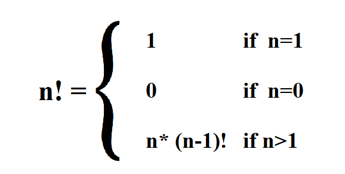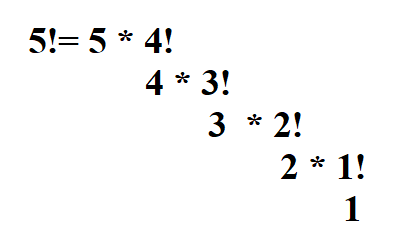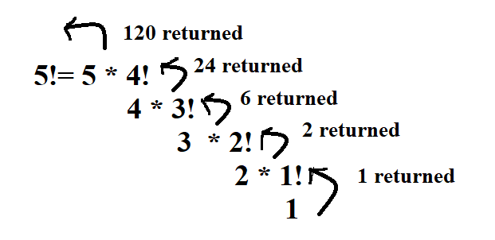

We can easily evaluate n! for any valid value of n by multiplying the
values iteratively. However, there is a much more interesting recursive
definition quite easily seen from the factorial expressions: 5! is
nothing other than 5 \* 4!. If we know 4!, we can trivially compute 5!.

4! on the other hand is 4 \* 3!, and so on until we have n! = n \* (n -
1)!, with 1! = 1 as the base case. The mathematicians have however added
the special case of 0! = 1 to make it easier (yes, it does, believe it
or not). For the purposes of this discussion, we'll use both 0! = 1 and
1! = 1 as the two base cases.

Now we can expand 5! recursively, stopping at the base condition.

The recursion tree for 5! shows the values as well.

> 130

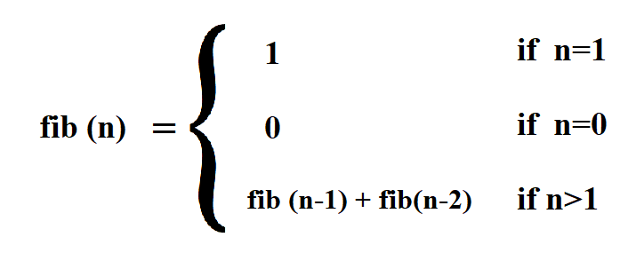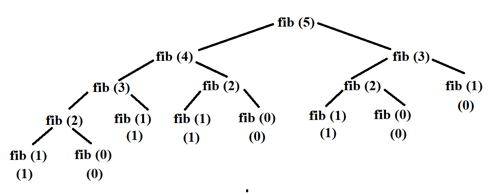

**A.2.2** **Fibonacci** **numbers:**

The Fibonacci numbers are ‹0, 1, 1, 2, 3, 5, 8, 13, ...› (some define it
without the leading 0, which is ok too). If we pay closer attention, we
see that each number, except for the first two, is nothing but the sum
of the previous two numbers. We can easily compute this iteratively, but
let's stick with the recursive method. We already have the recursive
part of the recursive definition, so all we need is the non-recursive
part or the base case. The mathematicians have decided that the first
two numbers in the sequence are 0 and 1, which give us the base cases
(notice the two base cases).

Now we can write the recursive definition for any Fibonacci number n \>=
0.

We can now compute fib(5) using this definition.

Before moving on, you should note how many times we're computing
Fibonacci of 3 (fib(3) above), and Fibonacci of 2 (fib(2) above) and so
on. This redundancy in computation leads to gross inefficiency, but
something we can easily address is Memoization, which is the later topic
we study.

> 131

A.3 Recursive programming

A recursive function is one that calls itself, since it needs to solve
the same problem, but on a smaller sized input. In essence, a recursive
function is a function that is defined in terms of itself.

Let's start with computing the factorial. We already have the recursive
definition, so the question is how do we convert that to a recursive
method that actually computes a factorial of a given non-negative
integer. This is an example of functional recursion.

> function factorial(n) if n == 0 or n == 1
>
> return 1 else
>
> return n \* factorial(n - 1) end if
>
> end function

Once you have formulated the recursive definition, the rest is usually
quite trivial. This is indeed one of the greatest advantages of
recursive programming.

Let's now look at an example of structural recursion, one that uses a
recursive data structure. We want to compute the sum of the list of
numbers. Linked list = 3-\> 8-\> 2-\> 1-\> 13-\> 4-\>None.

The "easiest" way to find the sum of numbers of a linked list
iteratively, as shown below.

> function sumList(head)
>
> sum = 0 // initialize the sum variable
>
> ptr = head // initialize a pointer to the head of the list while ptr
> is not null // loop until the end of the list
>
> sum = sum + ptr.data // add the current node's data to the sum ptr =
> ptr.next // move the pointer to the next node
>
> end while
>
> return sum // return the sum of the list end function

But a linked list is a recursive data structure. Hence, by thinking
recursively, we note the following:

1\. The sum of the numbers in a list is nothing but the sum of the first
number plus the sum of the rest of the list. The problem of summing the
rest of the list is the same problem as the original,

> 132

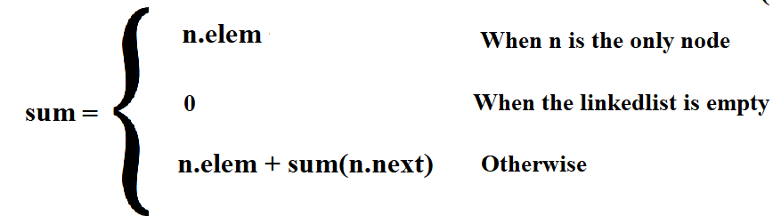

except that it's smaller by one element! Ah, recursion at play.

2\. The shortest list has a single number, which has the sum equal to
the number itself. Now we have a base case as well. Note that if we
allow our list of numbers to be empty, then the base case will need to
be adjusted as well: the sum of an empty list is simply 0.

Note the key difference between the iterative and recursive approaches:
for each number in the list vs the rest of the list.

Now we can write the recursive definition of this problem:

and using recursive definition, we can write the recursive method as
shown below:

> function sumList(head) if head is null
>
> return 0 else
>
> return head.data + sumList(head.next)

**Examples:**

Now we will look at the following examples which can be solved by
recursive programming:

1\. Length of a String

2\. Length of a linked list

3\. Sequential search in a sequence 4. Binary search in a sorted array

5\. Finding the maximum in a sequence (linear version) 6. Finding the
maximum in an array (binary version)

7\. Selection sort 8. Insertion sort

9\. Exponentiation – 𝑎𝑛

**A.3.1** **Length** **of** **a** **linked** **list:**

A linked list is also a recursive structure: a linked list is either
empty, or a node followed by the rest of the list.

> 133

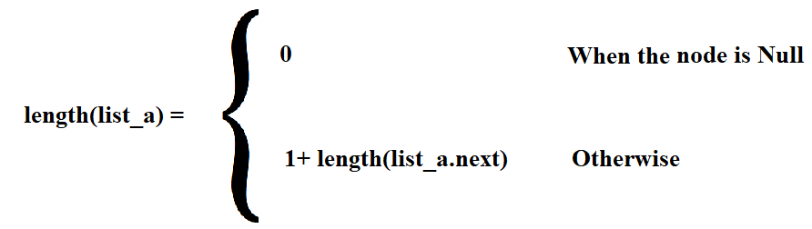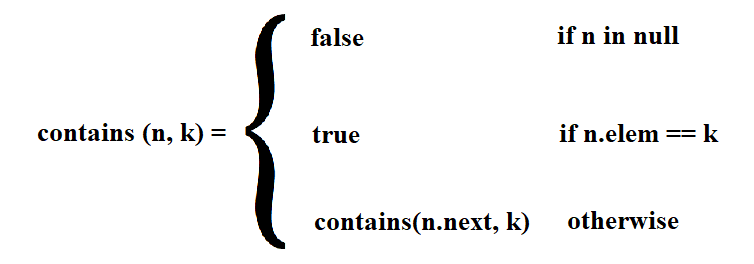

We can also compute the length of a list recursively as follows: the
length of a linked list is 1 longer than the rest of the list! The empty
list has a length of 0, which is our base case.

Recursive definition is given below:

Recursive process is shown below:

> function countList(head) if head is null
>
> return 0 else
>
> return 1 + countList(head.next)

**A.3.2** **Sequential** **search** **in** **a** **sequence:**

How would you find something in a linked list? Well, look at the first
node and check if the key is in that node. If so, done. Otherwise, check
the rest of the linked list for the given key. If you search an empty
list for any key, the answer is false, so that's our base case.

This is almost exactly the same, at least in form, as finding the length
of a linked list, and also an example of structural recursion.

Recursive definition is given below:

> 134

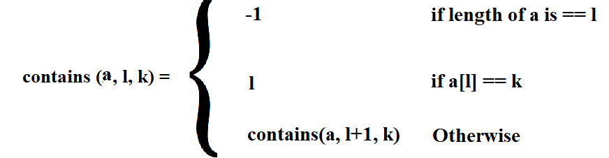

Recursive process is shown below:

> function sequentialSearch(head, key) if head is null
>
> return false
>
> else if head.data == key return true
>
> else
>
> return sequentialSearch(head.next, key)

What if the sequence is an array? How do we deal with the rest of the
array part then? We can handle it like this:

We can maintain a left index, along with a reference to the array, that
is used to indicate where the beginning of the array is.

Initially, left = 0, meaning that the array begins at the expected index
of 0. Eventually, a value of left = len(array) - 1 means that the rest
of the array is simply the last element, and then

left = len(array) means that it's an 0-sized array.

Recursive definition:

Recursive method:

> function sequentialSearch(array, index, key) if index \>= array.length
>
> return -1
>
> else if array\[index\] == key return index
>
> else
>
> return sequentialSearch(array, index + 1, key)

We start the search with **contains(arr,** **0,** **key)**, and then at
each step, the rest of the array is given by advancing the left
boundary(index).

> 135

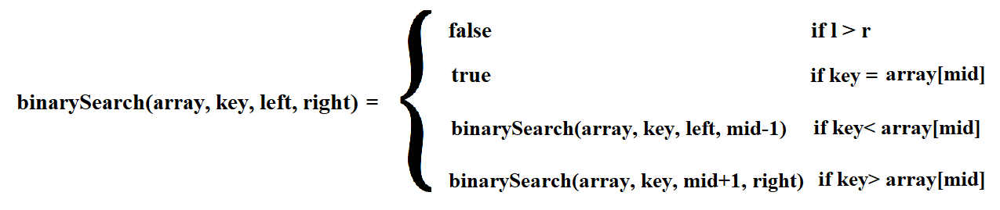

Instead of just a yes/no answer, what if we wanted the position of the
key in the array? We can simply **return** **left** instead of true as
the position if found, or use a sentinel -1 instead of false if not.

**A.3.3** **Binary** **search** **in** **a** **sorted** **array:**

Given the abysmal performance of sequential search, we obviously want to
use binary search whenever possible. Of course, the pre-conditions must
be met first:

1\. The sequence must support random access (an array that is) 2. The
data must be sorted

Now we can write the recursive definition:.

Recursive process:

> function binarySearch(array, key, left, right) if left \> right
>
> return -1 else
>
> mid = (left + right) / 2 if array\[mid\] == key
>
> return mid
>
> else if array\[mid\] \> key
>
> return binarySearch(array, key, left, mid - 1) else
>
> return binarySearch(array, key, mid + 1, right)

We start the search with **binarySearch(arr,** **key,** **0,**
**len(arr)** **-** **1)**, and then at each step, the rest of the array
is given by one half of the array – left or right, depending on the
comparison of the key with the middle element.

Instead of just a yes/no answer, what if we wanted the position of the
key in the array? We can simply **return** **mid** as the position
instead of true if found, or use a sentinel -1 instead of false if not.

**A.3.4** **Finding** **the** **maximum** **in** **a** **sequence**
**(linear** **version):**

Given a sequence of keys, our task is to find the maximum key in the
sequence. This is of course trivially done iteratively (for a non-empty
sequence): take the 1st one as maximum, and

> 136

then iterate from the 2nd to the end, exchanging the current with the
maximum if the current is larger than the maximum.

Formulating this recursively: the maximum key in a sequence is the
larger of the following two: 1. the 1st key in the sequence

2\. the maximum key in the rest of the sequence

Once we have (recursively) computed the maximum key in the rest of the
sequence, we just have to compare the 1st key with that, and we have our
answer! The base case is also trivial (for a non-empty sequence): the
maximum key in a single-element sequence is the element itself.

Since the rest of the sequence does not need random access, we can
easily do this for a linked list or an array. Let's write it for a
linked list first.

> function **findMax**(head) if head is null
>
> return -infinity else
>
> return max(head.data, **findMax**(head.next))

We start to find the maximum with **findMax(head)** (where head is the
reference to the first node of the list), and then at each step, the
rest of the array is given by advancing the head reference.

What if the sequence is an array? Well, then we use the same technique
we've used before — use a left (and optionally right) boundary to window
into the array.

Recursive process:

> function **findMax**(array, n) if n == 1
>
> return array\[0\] else
>
> return max(array\[n-1\], **findMax**(array, n-1))

We start to find the maximum with **findMax(arr,** **0)**, and then at
each step, the rest of the array is given by advancing the left
boundary(index).

**A.3.5** **Finding** **the** **maximum** **in** **an** **array**
**(binary** **version):**

If our sequence is an array, we can also find the maximum by formulating
the following recursive definition: the maximum key in an array is the
larger of the following two:

1\. the maximum key in the left half of the array 2. the maximum key in
the right half of the array

> 137
>
> function **findMax**(array, left, right) if left == right
>
> return array\[left\] else
>
> mid = (left + right) / 2
>
> leftMax = **findMax**(array, left, mid) rightMax = **findMax**(array,
> mid + 1, right) return max(leftMax, rightMax)

We start to find the maximum with **findMax(arr,** **0,**
**len(array)-1)**, and then at each step, the array is divided into two
halves.

A.4 Advance Recursion Part 1

**A.4.1** **Selection** **sort:**

How about sorting a sequence recursively? Since it does not require
random access, we'll look at recursive versions for both linked lists
and arrays.

The basic idea behind selection sort is the following: put the 1st
minimum in the 1st position, the 2nd minimum in the 2nd position, the
3rd minimum in the 3rd position, and so on until each key is placed in
its position according to its rank. To come up with a recursive
formulation, the following observation is the key:

Once the 1st minimum in the 1st position, it will never change its
position. Now all we have to do is to sort the rest of the sequence
(from 2nd position onwards), and we'll have a sorted sequence.

Now we can write the recursive definition for a linked list, and see the
pseudocode.

> function selectionSort(head)
>
> if head is null or head.next is null return head
>
> else
>
> min = findMin(head) // find the minimum node in the list swap(head,
> min) // swap the head node with the minimum node
>
> head.next = selectionSort(head.next) // recursively sort the rest of
> the list return head

Here, be careful about one thing: the swap method means we are not
exchanging the nodes rather than we are exchanging the element of nodes.

> 138
>
> Function swap(a, b)
>
> temp = a.element // store a.element in temp
>
> a.element = b.element // assign b.element to a.element b.element =
> temp // assign temp to b.element
>
> end Function

We sort a list headed by head reference by calling **selectSort(head)**.
Note that we're not finding the minimum key, but rather the node that
contains the minimum key since we need to exchange the left key with the
minimum one. We can write that iterative of course, but a recursive one
is simply more fun. This is of course almost identical to finding the
maximum in a sequence, with two differences: we find the minimum, and we
return the node that contains the minimum, not the actual minimum key.

Recursive process of findMin:

> function findMin(head) if head is null
>
> return else
>
> return min(head.data, findMin(head.next))

If the sequence is an array, then we have to use the left (and
optionally right) boundary to window into the array.

> function selectionSort(array, i = 0)
>
> if i == array length - 1 // base case: the array is sorted return
>
> else
>
> minIndex = i // assume the first element is the minimum
>
> for j = i + 1 to array length - 1 // loop through the rest of the
> array if array\[j\] \< array\[minIndex\] // find the actual minimum
>
> minIndex = j
>
> swap(array\[i\], array\[minIndex\]) // swap the minimum with the first
> element selectionSort(array, i + 1) // recursively sort the remaining
> array
>
> end function

Here, be careful about one thing: the swap method means we are not
exchanging the indices rather than we are exchanging the element of
these indices in the array.

> Function swap(a, b)
>
> temp = a // store a in temp a = b // assign b to a
>
> 139
>
> b = temp // assign temp to b end function

We sort an array(arr) by calling **selectSort(arr,** **0)**. **A.4.2**
**Insertion** **Sort:**

Insertion works by inserting each new key in a sorted array so that it
is placed in its rightful position, which now extends the sorted array
by the new key. In the beginning, there is a single key in the array,
which by definition is sorted. Then the second key arrives, which is
then inserted into the already sorted array (of one key at this point),
and now the sorted array has two keys. Then the third key arrives, which
is inserted into the already sorted array, creating a sorted array of 3
keys. And so on. Iteratively, it's a fairly simple operation. The
question is how can we formulate this recursively. The following
observation is the key to this recursive formulation:

Given an array of n keys, sort the first n-1 keys and then insert the
nth key in the sorted array such that all n keys are now sorted.

Note how the recursive part comes first, and then the nth key is
inserted (iteratively) into the sorted array.

Unlike recursive selection sort, we're going from right to left in the
recursive version of insertion sort. Note that we don't need random
access, but need to be able to iterate in both directions (reverse
direction to insert the new key in the sorted partition). So, if we're
sorting a linked list using the insertion sort algorithm, the list must
be doubly-linked.

Recursive process of insertion sort:

> function insertionSort(array, n, i = 1)
>
> if i == n // base case: the array is sorted return
>
> else
>
> key = array\[i\] // store the current element j = i - 1 // start from
> the previous element
>
> while j \>= 0 and array\[j\] \> key // loop through the sorted
> subarray array\[j + 1\] = array\[j\] // shift the larger elements to
> the right
>
> j = j - 1 // move to the next element
>
> array\[j + 1\] = key // insert the current element in the correct
> position insertionSort(array, n, i + 1) // recursively sort the
> remaining array
>
> end function

We sort an array(arr) by calling **insertionSort(arr,** **len(arr)-**
**1,** **1)**.

**A.4.3** **Exponentiation** **–** 𝑎𝑛**:**

> 140

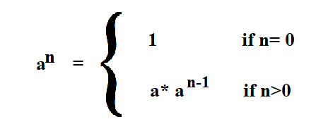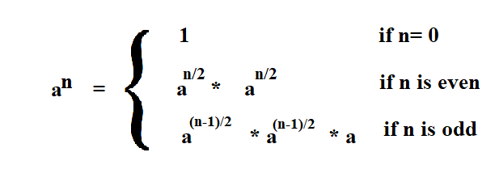

This is another example of functional recursion. To compute 𝑎𝑛, we can
iteratively multiply a n times, and that's that. Thinking recursively,
𝑎𝑛 = a \* 𝑎𝑛−1, and 𝑎𝑛−1 = a \* 𝑎𝑛−2, and so on. The recursion stops
when the exponent n = 0, since by definition 𝑎0 = 1.

Recursive definition:

Recursive approach:

> function power(base, exponent)
>
> if exponent == 0 // base case: any number raised to 0 is 1 return 1
>
> else
>
> return base \* power(base, exponent - 1) // recursive case: multiply
> the base by itself exponent times
>
> end function

As it turns out, there is actually a much more efficient recursive
formulation for the exponentiation of a number. We start by noting that
28 = 24 \* 24, and that 27 = 23 \* 23 \* 2. We can generalize that with
the following recursive definition, and its implementation.

Recursive approach:

> function power(base, exponent)
>
> if exponent == 0 // base case: any number raised to 0 is 1 return 1
>
> 141
>
> else
>
> If exponent is even
>
> return power(base, exponent/2)\*power(base, exponent/2) else
>
> return power(base, (exponent-1)/2)\*power(base, (exponent-1)/2) \* a

But why would we care about this formulation over the more familiar one?
If we solve for the running time, both solutions take the same time, so
what is the benefit of this approach? Notice how we're computing the
following expressions twice:

1\. exp(a, n/2)

2\. exp(a, (n - 1)/2)

**Why** **not** **compute** **it** **once,** **and** **then** **use**
**the** **result** **twice** **(or** **as** **many** **times** **as**
**needed)?** We can, and as we will find out, that will give us a huge
boost when we compute the running time of this algorithm. Here is the
modified version.

> function power(base, exponent)
>
> if exponent == 0 // base case: any number raised to 0 is 1 return 1
>
> else
>
> If exponent is even
>
> temp = power(base, exponent/2) return temp \* temp
>
> else
>
> temp = power(base, (exponent-1)/2) return temp \* temp \* base

All we are doing is removing the redundancy in computations by saving
the intermediate results in temporary variables. This is a simple case
of a technique known as **Memoization**, which is the next topic we
study. Remember that we have already seen such redundancy in recursive
computation — when computing the Fibonacci numbers.

A.5 Issues/problems to watch out for

1\. **Inefficient** **recursion:**

The recursive solution for Fibonacci numbers outlined in these notes
shows massive redundancy, leading to very inefficient computation. The
1st recursive solution for exponentiation also shows how redundancy
shows up in recursive programs. There are ways to avoid computing the
same value more than once by caching the intermediate results, either
using Memoization (a top-down technique — see next topic), or Dynamic
Programming (a bottom-up technique — survive this semester to enjoy it
in the next one).

2\. **Space** **for** **activation** **frames:**

> 142

Each recursive method call requires that it's activation record be put
on the system call stack. As the depth of recursion gets larger and
larger, it puts pressure on the system stack, and the stack may
potentially run out of space.

3\. **Infinite** **recursion:**

Ever forgot a base case? Or miss one of the base cases? You end up with
infinite recursion, since there is nothing stopping your recursion!
Whenever you see a Stack Overflow error, check your recursion!

A.6 Advanced Recursion Part 2: Optimizing Recursive Program Memoization

**A.6.1** **Introduction:**

To develop a recursive algorithm or solution, we first have to define
the problem (and the recursive definition, often the hard part), and
then implement it (often the easy part). This is called the **top-down**
solution, since the recursion opens up from the top until it reaches the
base case(s) at the bottom.

Once we have a recursive algorithm, the next step is to see if there are
**redundancies** in the computation— that is, if the same values are
being computed multiple times. If so, we can benefit from **memoizing**
the recursion. And in that case, we can create a memoized version and
see what savings we get in terms of the running time.

Recursion has certain overhead costs that may be minimized by
transforming the memoized recursion into an iterative solution. And,
finally, we see if there are further improvements that we can make to
improve the time and space complexity.

The steps are as follows:

1\. write down the recursion,

2\. implement the recursive solution, 3. memoize it,

4\. transform into an iterative solution, and finally 5. make further
improvements.

**A.6.2** **Example** **using** **the** **Fibonacci** **sequence:**

To see this in action, let's take Fibonacci numbers as an example.
Fortunately for us, the mathematicians have already defined the problem
for us – the Fibonacci numbers are ‹ 0, 1, 1, 2, 3, 5, 8, 13,... › (some
define it without the leading 0, which is ok too). Each number, except
for the first two, is nothing but the sum of the previous two numbers.
The first two are by definition 0 and 1. These two facts give us the
recursive definition to compute the nth Fibonacci number for some n \>=
0.

Let's go through the 5 steps below.

**Step** **1:** **Write** **or** **formulate** **the** **recursive**
**definition** **of** **the** **nth** **Fibonacci** **number**
**(defined** **only** **for** **n\>=0)**

> 143

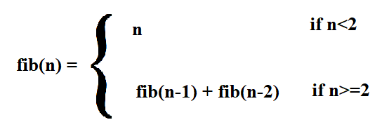

**Step** **2:** **Write** **the** **recursive** **implementation.**
**This** **usually** **follows** **directly** **from** **the**
**recursive** **definition**

> function fib(n)
>
> if n == 0 or n == 1 // base case: the first two Fibonacci numbers are
> 0 and 1 return n
>
> else // recursive case: use the Fibonacci formula return fib(n - 1) +
> fib(n - 2)
>
> end function

**Step** **3:** **Memoize** **the** **recursion**

Would this recursion benefit from memoization? Well, let's see by
"unrolling" the recursion **fib(5)** a few levels:

Now you should notice something very interesting — we're computing the
same fibonacci number quite a few times. We're computing fib(2) 3 times
and fib(3) 2 times. Is there any reason why we couldn't simply save the
result after computing it the first time, and re-using it each time it's
needed afterward?

This is the primary motivation for **memoization** – to avoid
re-computing overlapping subproblems. In this example, fib(2) and fib(3)
are overlapping subproblems that occur independently in different
contexts.

> 144

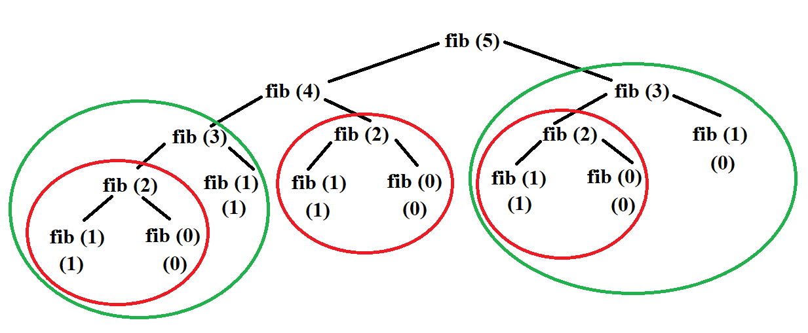

Memoization certainly looks like a good candidate for this particular
recursion, so we'll go ahead and memoize it. Of course, the first
question is how we save the results of these overlapping subproblems
that we want to reuse later on.

The basic idea is very simple — before computing the ith fibonacci
number, first check if that has already been solved; if so, just look up
the answer and return; if not, compute it and save it before returning
the value. We can modify our fib method accordingly (using some
pseudocode for now). Since fibonacci is a function of 1 integer
parameter, the easiest is to use a 1-dimensional array or table with a
capacity of **n** **+** **1** (we need to store fib(0) ... fib(n), which
requires n + 1 slots) to store the intermediate results.

What is the cost of memoizing a recursion? It's the space needed to
store the intermediate results. Unless there are overlapping
subproblems, memoizing a recursion will not buy you anything at all, and
in fact, cost you more space for nothing!

Remember this — **memoization** **trades** **space** **for** **time.**

Let's try out our first memoized version. (M_fib below stands for
**"memoized** **fibonacci"**).

> function fib(n)
>
> // assume that we have a “global” array (also called a table) with n+1
> capacity
>
> // check if the nth Fibonacci number is already computed if memo\[n\]
> is not null
>
> return memo\[n\] else
>
> // base case: the first two Fibonacci numbers are 0 and 1 if n == 0 or
> n == 1
>
> memo\[n\] = n else
>
> // recursive case: use the Fibonacci formula and store the result
>
> 145
>
> memo\[n\] = fib(n - 1) + fib(n - 2)
>
> return memo\[n\]
>
> end function

**Think** **about** **why** **we** **used** **a** **global** **array**
**instead** **of** **declaring** **arrays** **inside** **the**
**function!**

This is all that we need to avoid redundant computations of overlapping
subproblems. The first time fib(3) is called, it will compute the value
and save the answer in memo\[3\], and then subsequent calls would simply
return memo\[3\] without doing any work at all!

There are a few details we have left out at this point:

1\. Where would we create this "table" to store the results?

2\. How can we initialize each element of memo to indicate that the
value has not been computed/saved yet?(Note the **"is** **empty"** in
the code above).

Let's take these one at a time.

1\. The "fib" method is a function of a single parameter — n, so if we
wanted to save the intermediate results, all we need is an array that
goes from 0 ... n (i.e., of n + 1 capacity). Since the local variables
within a method are created afresh each time the method is called, F
cannot be a local array. We can either use an instance variable within
an object, or create an array in the caller of fib(n), and then pass the
array to fib (in which case we will have to modify fib to have another
parameter).

2\. We need to use a sentinel which will indicate that the value has not
been computed. Since it's an array of integers, we can't use null (which
is the sentinel used to indicate the absence of an object).

However, we know that the nth fibonacci number is a non-negative
integer, so we can use any negative number as the sentinel. **Let**
**us** **choose** **-1**. So, let's have an array F of n+1 capacity that
holds all the values of the intermediate results we need to compute the
nth Fibonacci number.

We can have a wrapper method, which creates this array or table,
initializes the table and passes it onto M_fib as a parameter.

First, the wrapper method called **fib**, which basically sets up the
table for **M_fib**, and calls it on the user's behalf.

> function fib(n)
>
> Create an array (also called a table) with n+1 capacity named memo
> Call M_fib(n,memo)
>
> function M_fib(n, memo)
>
> // check if the nth Fibonacci number is already computed if memo\[n\]
> is not null
>
> 146
>
> return memo\[n\] else
>
> // base case: the first two Fibonacci numbers are 0 and 1 if n == 0 or
> n == 1
>
> memo\[n\] = n else
>
> // recursive case: use the Fibonacci formula and store the result
> memo\[n\] = M_fib(n - 1) + M_fib(n - 2)
>
> return memo\[n\]
>
> end function

To compute the 5th fibonacci number, we simply call **fib(5)**, which in
turn calls **M_fib(5,** **F)** to compute and return the value.

Now that we have a memoized fibonacci, the next question is to see if we
can improve the space overhead of memoization.

**Step** **4:** **Convert** **the** **recursion** **to** **iteration**
**–** **the** **bottom-up** **solution.**

To compute the 5th fibonacci number, we wait for 4th and 3rd, which in
turn wait for 2nd, and so on until the base cases of n = 0 and n = 1
return the values which move up the recursion stack. Other than the n =
0 and n = 1 base cases, the first value that is actually computed and
saved is n = 2, and then n= 3, and then n = 4 and finally n = 5. Then
why not simply compute the solutions for

n = 2, 3, 4, 5 by iterating (using the base cases of course), and fill
in the table from left to right? This is called the **bottom-up**
solution since the recursion tree starts at the bottom (the base cases)
and works its way up to the top of the tree (the initial call). The
bottom-up technique is more popularly known as **dynamic**
**programming**, a topic that we will spend quite a bit of time on next
semester!

> function fib(n)
>
> // create an array to store the Fibonacci numbers array f\[n + 1\]
>
> // initialize the first two Fibonacci numbers f\[0\] = 0
>
> f\[1\] = 1
>
> // loop from the third Fibonacci number to the nth Fibonacci number
> for i = 2 to n
>
> // use the Fibonacci formula and store the result in the array f\[i\]
> = f\[i - 1\] + f\[i - 2\]
>
> end for
>
> // return the nth Fibonacci number return f\[n\]
>
> 147
>
> end function

You should convince yourself that this is indeed a solution to the
problem, only using iteration instead of memoized recursion. Also, that
it solves each subproblem (e.g., fib(3) and fib(2)) exactly once, and
re-uses the saved answer.

This one avoids the overhead of recursion by using iteration, so tends
to run much faster.

Can we improve this any further?

**Step** **5:** **improving** **the** **space-requirement** **in**
**the** **bottom-up** **version**

The nth Fibonacci number depends only on the (n - 1)th and (n - 2)th
Fibonacci numbers. However, we are storing ALL the intermediate results
from 2 ... n - 1 Fibonacci numbers before computing the nth one. What if
we simply store the last two? In that case, instead of having an array
of n + 1 capacity, we need just two instance variables (or an array with
2 elements). Here's what the answer may look like.

> function fib(n)
>
> // initialize the first two Fibonacci numbers f0 = 0
>
> f1 = 1
>
> // loop from the first Fibonacci number to the nth Fibonacci number
> for i = 0 to n - 1
>
> // use the Fibonacci formula and store the result in a temporary
> variable temp = f0 + f1
>
> // update the previous two Fibonacci numbers f0 = f1
>
> f1 = temp end for
>
> // return the nth Fibonacci number return f0
>
> end function
>
> 148
>
> **Exercises**

**A.1:** Given a non-negative int n, return the sum of its digits
recursively (no loops). Note that mod (%) by 10 yields the rightmost
digit (126 % 10 is 6), while divide (/) by 10 removes the rightmost
digit (126 / 10 is 12).

Example:

Input: sumDigits(126) Output: 9

Input: sumDigits(49) Output: 13

Input: sumDigits(12) Output: 3

**A.2:** We have bunnies standing in a line, numbered 1, 2, ... The odd
bunnies (1, 3, ..) have the normal 2 ears. The even bunnies (2, 4, ..)
we'll say have 3 ears, because they each have a raised foot. Recursively
return the number of "ears" in the bunny line 1, 2, ... n (without loops
or multiplication).

Example:

Input: bunnyEars2(0) Output: 0

Input: bunnyEars2(1) Output: 2

Input: bunnyEars2(2) Output: 5

**A.3:** Given a non-negative int n, return the count of the occurrences
of 7 as a digit, so for example 717 yields 2. (no loops). Note that mod
(%) by 10 yields the rightmost digit (126 % 10 is 6), while divide (/)
by 10 removes the rightmost digit (126 / 10 is 12).

Example:

Input: count7(717) Output: 2

Input: count7(7) Output: 1

Input: count7(123) Output: 0

**A.4:** Given a string, compute recursively (no loops) the number of
lowercase 'x' chars in the string.

Example:

> 149

Input: countX("xxhixx") Output: 4

Input: countX("xhixhix") Output: 3

Input: countX("hi") Output: 0

**A.5:** Given a string, compute recursively (no loops) a new string
where all appearances of "pi" have been replaced by "3.14".

Example:

Input: changePi("xpix") Output: "x3.14x"

Input: changePi("pipi") Output: "3.143.14"

Input: changePi("pip") Output: "3.14p"

**A.6:** Given an array of ints, compute recursively the number of times
that the value 11 appears in the array. We'll use the convention of
considering only the part of the array that begins at the given index.
In this way, a recursive call can pass index+1 to move down the array.
The initial call will pass in index as 0.

Example:

Input: array11(\[1, 2, 11\], 0) Output: 1

Input: array11(\[11, 11\], 0) Output: 2

Input: array11(\[1, 2, 3, 4\], 0) Output: 0

**A.7:** Given a string, compute recursively a new string where
identical chars that are adjacent in the original string are separated
from each other by a "\*".

Example:

Input: pairStar("hello") Output: "hel\*lo"

Input: pairStar("xxyy") Output: "x\*xy\*y"

Input: pairStar("aaaa") Output: "a\*a\*a\*a"

> 150

**A.8:** Count recursively the total number of "abc" and "aba"
substrings that appear in the given string.

Example:

Input: countAbc("abc") Output: 1

Input: countAbc("abcxxabc") Output: 2

Input: countAbc("abaxxaba") Output: 2

**A.9:** Given a string, compute recursively the number of times
lowercase "hi" appears in the string, however do not count "hi" that
have an 'x' immedately before them.

Example:

Input: countHi2("ahixhi") Output: 1

Input: countHi2("ahibhi") Output: 2

Input: countHi2("xhixhi") Output: 0

**A.10:** Given a string and a non-empty substring sub, compute
recursively the number of times that sub appears in the string, without
the sub strings overlapping.

Example:

Input: strCount("catcowcat", "cat") Output: 2

Input: strCount("catcowcat", "cow") Output: 1

Input: strCount("catcowcat", "dog") Output: 0

**A.11:** We have a number of bunnies and each bunny has two big floppy
ears. We want to compute the total number of ears across all the bunnies
recursively (without loops or multiplication).

Example:

Input: bunnyEars(0) Output: 0

Input: bunnyEars(1) Output: 2

> 151

Input: bunnyEars(2) Output: 4

**A.12:** We have triangle made of blocks. The topmost row has 1 block,
the next row down has 2 blocks, the next row has 3 blocks, and so on.
Compute recursively (no loops or multiplication) the total number of
blocks in such a triangle with the given number of rows.

Example:

Input: triangle(0) Output: 0

Input: triangle(1) Output: 1

Input: triangle(2) Output: 3

**A.13:** Given a string, compute recursively a new string where all the
'x' chars have been removed.

Example:

Input: noX("xaxb") Output: "ab"

Input: noX("abc") Output: "abc"

Input: noX("xx") Output: ""

**A.14:** Given an array of ints, compute recursively if the array
contains somewhere a value followed in the array by that value times 10.
We'll use the convention of considering only the part of the array that
begins at the given index. In this way, a recursive call can pass
index+1 to move down the array. The initial call will pass in index as
0.

Example:

Input: array220(\[1, 2, 20\], 0) Output: True

Input: array220(\[3, 30\], 0) Output: True

Input: array220(\[3\], 0) Output: False

**A.15:** Given a string, compute recursively a new string where all the
lowercase 'x' chars have been moved to the end of the string.

Example:

Input: endX("xxre")

> 152

Output: "rexx"

Input: endX("xxhixx") Output: "hixxxx"

Input: endX("xhixhix") Output: "hihixxx"

**A.16:** Given a string, compute recursively (no loops) the number of
"11" substrings in the string. The "11" substrings should not overlap.

Example:

Input: count11("11abc11") Output: 2

Input: count11("abc11x11x11") Output: 3

Input: count11("111") Output: 1

**A.17:** Given a string that contains a single pair of parenthesis,
compute recursively a new string made of only of the parenthesis and
their contents, so "xyz(abc)123" yields "(abc)".

Example:

Input: parenBit("xyz(abc)123") Output: "(abc)"

Input: parenBit("x(hello)") Output: "(hello)"

Input: parenBit("(xy)1") Output: "(xy)"

**A.18:** Given a string and a non-empty substring sub, compute
recursively if at least n copies of sub appear in the string somewhere,
possibly with overlapping. N will be non-negative.

Example:

Input: strCopies("catcowcat", "cat", 2) Output: True

Input: strCopies("catcowcat", "cow", 2) Output: False

Input: strCopies("catcowcat", "cow", 1) Output: True

**A.19:** Given a string, compute recursively (no loops) a new string
where all the lowercase 'x' chars have been changed to 'y' chars.

> 153

Example:

Input: changeXY("codex") Output: "codey"

Input: changeXY("xxhixx") Output: "yyhiyy"

Input: changeXY("xhixhix") Output: "yhiyhiy"

**A.20:** Given an array of ints, compute recursively if the array
contains a 6. We'll use the convention of considering only the part of
the array that begins at the given index. In this way, a recursive call
can pass index+1 to move down the array. The initial call will pass in
index as 0.

Example:

Input: array6(\[1, 6, 4\], 0) Output: True

Input: array6(\[1, 4\], 0) Output: False

Input: array6(\[6\], 0) Output: True

**A.21:** Given a string, compute recursively a new string where all the
adjacent chars are now separated by a "\*".

Example:

Input: allStar("hello") Output: "h\*e\*l\*l\*o"

Input: allStar("abc") Output: "a\*b\*c"

Input: allStar("ab") Output: "a\*b"

**A.22:** We'll say that a "pair" in a string is two instances of a char
separated by a char. So "AxA" the A's make a pair. Pair's can overlap,
so "AxAxA" contains 3 pairs -- 2 for A and 1 for x. Recursively compute
the number of pairs in the given string.

Example:

Input: countPairs("axa") Output: 1

Input: countPairs("axax") Output: 2

Input: countPairs("axbx") Output: 1

> 154

**A.23:** Given a string, return recursively a "cleaned" string where
adjacent chars that are the same have been reduced to a single char. So
"yyzzza" yields "yza".

Example:

Input: stringClean("yyzzza") Output: "yza"

Input: stringClean("abbbcdd") Output: "abcd"

Input: stringClean("Hello") Output: "Helo"

**A.24:** Given a string, return true if it is a nesting of zero or more
pairs of parenthesis, like "(())" or "((()))". Suggestion: check the
first and last chars, and then recur on what's inside them.

Example:

Input: nestParen("(())") Output: True

Input: nestParen("((()))") Output: True

Input: nestParen("(((x))") Output: False

**A.25:** Given a string and a non-empty substring sub, compute
recursively the largest substring which starts and ends with sub and
return its length.

Example:

Input: strDist("catcowcat", "cat") Output: 9

Input: strDist("catcowcat", "cow") Output: 3

Input: strDist("cccatcowcatxx", "cat") Output: 9

**A.26:** Given an array of ints, is it possible to choose a group of
some of the ints, such that the group sums to the given target? This is
a classic backtracking recursion problem. Once you understand the
recursive backtracking strategy in this problem, you can use the same
pattern for many problems to search a space of choices. Rather than
looking at the whole array, our convention is to consider the part of
the array starting at index start and continuing to the end of the
array. The caller can specify the whole array simply by passing start as
0. No loops are needed -- the recursive calls progress down the array.

Example:

Input: groupSum(0, \[2, 4, 8\], 10)

> 155

Output: True

Input: groupSum(0, \[2, 4, 8\], 14) Output: True

Input: groupSum(0, \[2, 4, 8\], 9) Output: False

**A.27:** Given an array of ints, is it possible to divide the ints into
two groups, so that the sums of the two groups are the same. Every int
must be in one group or the other. Write a recursive helper method that
takes whatever arguments you like, and make the initial call to your
recursive helper from splitArray(). (No loops needed.)

Example:

Input: splitArray(\[2, 2\]) Output: True

Input: splitArray(\[2, 3\]) Output: False

Input: splitArray(\[5, 2, 3\]) Output: True

**A.28:** Given an array of ints, is it possible to divide the ints into
two groups, so that the sum of one group is a multiple of 10, and the
sum of the other group is odd. Every int must be in one group or the
other. Write a recursive helper method that takes whatever arguments you
like, and make the initial call to your recursive helper from
splitOdd10(). (No loops needed.)

Example:

Input: splitOdd10(\[5, 5, 5\]) Output: True

Input: splitOdd10(\[5, 5, 6\]) Output: False

Input: splitOdd10(\[5, 5, 6, 1\]) Output: True

**A.29:** Given an array of ints, is it possible to divide the ints into
two groups, so that the sum of the two groups is the same, with these
constraints: all the values that are multiple of 5 must be in one group,
and all the values that are a multiple of 3 (and not a multiple of 5)
must be in the other. (No loops needed.)

Example:

Input: split53(\[1, 1\]) Output: True

Input: split53(\[1, 1, 1\]) Output: False

Input: split53(\[2, 4, 2\])

> 156

Output: True

**A.30:** Given an array of ints, is it possible to choose a group of
some of the ints, such that the group sums to the given target with
these additional constraints: all multiples of 5 in the array must be
included in the group. If the value immediately following a multiple of
5 is 1, it must not be chosen. (No loops needed.)

Example:

Input: groupSum5(0, \[2, 5, 10, 4\], 19) Output: True

Input: groupSum5(0, \[2, 5, 10, 4\], 17) Output: True

Input: groupSum5(0, \[2, 5, 10, 4\], 12) Output: False

> 157
