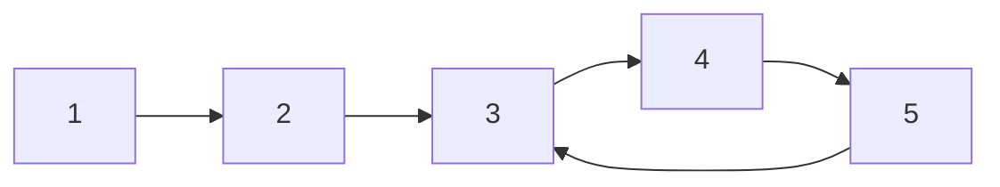
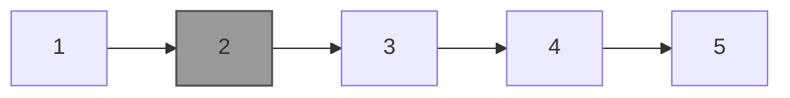
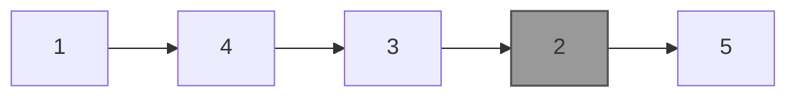

# Practice Sheet - Linked List

---

### Node Class Definition

```python
class Node:
    def __init__(self, elem, next=None):
        self.elem = elem
        self.next = next
```

You may modify the `Node` class as needed for specific problems.

---

## Question 01: Move Last Node to Front

**Problem:** Write a function that moves the last node to the front in a given singly linked list.

**Input / Output:**

```
Input:  1 → 2 → 3 → 4 → 5
Output: 5 → 1 → 2 → 3 → 4

Input:  3 → 8 → 1 → 5 → 7 → 12
Output: 12 → 3 → 8 → 1 → 5 → 7
```


---

## Question 02: Intersection of Two Sorted Linked Lists

**Problem:** Given two sorted linked lists, create and return a new list representing the intersection of the two lists. The new list should be created with new memory; original lists must remain unchanged.

**Input / Output:**

```
Input:
First:  1 → 2 → 3 → 4 → 6
Second: 2 → 4 → 6 → 8
Output: 2 → 4 → 6

Input:
First:  1 → 2 → 3 → 4 → 5
Second: 2 → 3 → 4
Output: 2 → 3 → 4
```

---

## Question 03: Reverse Even-Integer Subparts

**Problem:** Given a linked list containing N integers, you are given a list that has been reversed in parts containing even numbers only. Restore the original list.

**Input Format:**

```
N (size of list)
N space-separated integers representing the reversed list
```

**Output Format:**

```
N space-separated integers representing the original list
```

**Example:**

```
Input:
9
2 18 24 3 5 7 9 6 12

Output:
24 18 2 3 5 7 9 12 6
```

---

## Question 04: Move Even Numbers Before Odd

**Problem:** Modify a linked list so that all even numbers appear before all odd numbers, preserving their relative order.

**Input / Output:**

```
Input:  17 → 15 → 8 → 12 → 10 → 5 → 4 → 1 → 7 → 6 → None
Output: 8 → 12 → 10 → 4 → 6 → 17 → 15 → 5 → 1 → 7 → None

Input:  8 → 12 → 10 → 5 → 4 → 1 → 6 → None
Output: 8 → 12 → 10 → 4 → 6 → 5 → 1 → None
```

---

## Question 05: Nth Node from the End

**Problem:** Given a linked list and an integer N, return the value at the Nth node from the end.

**Input / Output:**

```
Input:  10 → 20 → 30 → 40 → 50 → None, N = 2
Output: 40

Input:  35 → 15 → 4 → 20 → 45 → None, N = 4
Output: 15
```

---

## Question 06: Find Middle of Linked List

**Problem:** Find the middle node of a linked list. If even nodes exist, return the **second** middle element.

**Input / Output:**

```
Input:  10 → 20 → 30 → 40 → 50 → None
Output: 30

Input:  1 → 2 → 3 → 4 → 5 → 6 → None
Output: 4
```

---

## Question 07: Detect Loop in a Linked List

**Problem:** Determine whether a given linked list contains a loop.

**Diagram:**



---

## Question 08: Delete Friends (Hackerearth Problem)

**Scenario:** Christie decides to remove some friends based on popularity.

**Pseudocode:**

```
procedure DeleteFriends(Friends, K)
    repeat K times
        deleted ← false
        for i ← 1 to length(Friends) - 1
            if Friends[i].popularity < Friends[i+1].popularity then
                remove Friends[i]
                deleted ← true
                break
        if deleted = false then
            remove last friend
    return Friends
```

**Input / Output:**

```
Input:
3
3 1
3 100 1
5 2
19 12 3 4 17
5 3
23 45 11 77 18

Output:
100 1
19 12 17
77 18
```

---

## Question 09: Palindrome Linked List

**Problem:** Check if a linked list is a palindrome.

**Input / Output:**

```
Input:  1 → 2 → 3 → 2 → 1 → None
Output: True

Input:  1 → 2 → 3 → 1 → 1 → None
Output: False
```

---

## Question 10: Delete Alternate Nodes

**Problem:** Delete every alternate node starting from the second node.

**Input / Output:**

```
Input:  10 → 20 → 30 → 40 → 50 → None
Output: 10 → 30 → 50 → None

Input:  1 → 2 → 3 → 4 → 5 → 6 → None
Output: 1 → 3 → 5 → None
```

---

## Question 11: Check if Two Linked Lists are Identical

**Problem:** Two linked lists are identical if they have the same data in the same order.

**Input / Output:**

```
Input:
List A: 1 → 2 → 3 → 4 → 5 → None
List B: 1 → 2 → 3 → 4 → 5 → None
Output: Identical

Input:
List A: 1 → 2 → 3 → 4 → None
List B: 1 → 7 → 4 → 5 → None
Output: Not Identical
```

---

## Question 12: Swap Kth Node from Start and End

**Problem:** Given a linked list and an integer k, swap the kth node from the start and kth from the end. 
Return the head of the linked list after swapping the values of the kth node from the beginning
and the kth node from the end (the list is 1-indexed).




**Input / Output:**

```
Input:
1 → 2 → 3 → 4 → 5 → None
k = 2
Output:
1 → 4 → 3 → 2 → 5 → None

Input:
1 → 7 → 4 → 5 → None
k = 2
Output:
1 → 4 → 7 → 5 → None
```


---

### References

1. [GeeksforGeeks - Linked List Practice Questions](https://www.geeksforgeeks.org/practice-questions-for-linked-list-and-recursion/)
2. [HackerEarth - Reversed Linked List Problem](https://www.hackerearth.com/practice/data-structures/linked-list/singly-linked-list/practice-problems/algorithm/reversed-linked-list-01b722df/)
3. [HackerEarth - Remove Friends Problem](https://www.hackerearth.com/practice/data-structures/linked-list/singly-linked-list/practice-problems/algorithm/remove-friends-5/)
4. [OpenGenus - Linked List Problems](https://iq.opengenus.org/list-of-linked-list-problems/)
5. [LeetCode - Swapping Nodes in a Linked List](https://leetcode.com/problems/swapping-nodes-in-a-linked-list/)
