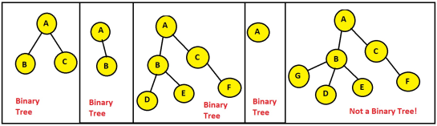

# Chapter 5: Tree

## 5.1 Tree Basics

Tree is a non-linear data structure that allows us to organize, access and update data efficiently by representing non-linear data in a form of hierarchy.

### 5.1.1 Introduction to Tree Data Structure
We have covered a number of data structures so far in this course. However, trees are extremely unique as some feats can only be achieved efficiently using trees. Following are some real life applications of trees:

- Continuous Sorting can be achieved using trees. Imagine you have a sorted array of 1 million data. Now you have to add 1000 more data into it. Then comes the responsibility of sorting the entire array again. However, using one variation of trees (Binary Search Tree), we can efficiently insert data later in a sorted manner without having to sort all the data again and again.
- Trees are widely used in folder/file system structure. For example, your desktop folder is the root of the tree and in your desktop you have multiple folders, and in those folders, you have some files. These files are the leaf nodes of the tree.
- Trees are used in electrical circuit designing and electricity transmission. For example, suppose you have a main center point from where all the electricity is generated and from there on it will be spread into branches until it reaches every home, office or industry.
- Router/Computer Network algorithms construct trees of the locations across the network to determine the route that data packets must follow to reach their destination efficiently.

### 5.1.2 Terminologies of a Tree

#### 5.1.2.1 Root/Leaf/Non-Leaf Node:
Each tree consists of one or more nodes that are interlinked. The topmost node is called the **root** node. Below the root there are one or more nodes. The nodes residing at the bottom, or in other words the nodes that do not lead to any other node are called **leaf** nodes. If we have access to the root node, we have access to the entire tree.

- 

Here we can see that node A is the root node, Nodes E, H, G, and D are the leaf nodes. Nodes A, B, F, and C are non-leaf nodes. The root node and the non-leaf nodes can be considered as internal nodes.

**5.1.2.2 Parent/Child:**

The direction of the tree is from top to bottom. Which means Node B is the immediate successor of node A, and Node A is the immediate predecessor of node B. Therefore, node B is the child of A, whereas, A is the parent of B.

**5.1.2.3 Siblings:**

All the nodes having the same parent are known as siblings. Therefore, B, C, and D are siblings, and F and G are siblings.

**5.1.2.4 Edge/Path:**

The link between two nodes is called an edge. A path is known as the consecutive edges from the source node to the destination node. So, if we asked what is the path from node A to E? The answer would be A→B→E. A tree having n number of nodes will have (n-1) number of edges. Here, we have 8 nodes and 7 edges in total.

**5.1.2.5 Degree:**

The number of children of a node is known as degree. The degree of node A is 3, node B is 1 and Node E is 0.

**5.1.2.6 Depth:**

The length of the path from a node to the root node is known as the depth. The depth of nodes E, F, and G is 2; depth of B, C, and D is 1; depth of A is 0; depth of H is 3.

**5.1.2.7 Height:**

The length of the longest path from a node to one of its leaf nodes is known as the height. From node A to the leaf nodes there are four paths: A→B→E, A→C→F→H, A→C→G, and A→D. Of these four paths, A→C→F→H is the longest path. Hence, the height of Node A is 3.

**5.1.2.8 Level:**

Each hierarchy starting from the root is known as the level.

- 

From the above figure, we can see that the level of node A is 0; level of nodes B, C, and D is 1; level of nodes E, F, and G is 2; and level of node H is 3.

_Points to remember:_

* - _The depth and height of a node may not be the same. The depth of A is 0, whereas, the height of A is 3._
* - _Level of a node == Depth of that node._

**5.1.2.9 Subtree:**

A tree that is the child of a Node.

- 

Any tree can be further divided into subtrees with respect to a particular node. Here node A has three subtrees that are shown on the right side.

### 5.1.3 Characteristics of a Tree

- A tree must be continuous and not disjoint, which means every single node must be traversable starting from the root node.
- A tree cannot have a cycle. A tree having n number of nodes will have n or more edges if it contains one or more cycles. This means, for a tree, no of edges == no of nodes - 1.

- 

### 5.1.4 Tree Coding - Tree Construction using Linked List (Dynamic Representation)

A tree can be represented using a linked list (Dynamic Representation) or an array (Sequential Representation). Here we shall see how to dynamically represent trees.

1. Create a class called 'Node' with the following data members:
   - 'elem': to store the value of the node.
   - an array named 'children': to store the references of all the children.

2. The first node created becomes the root of the tree

3. After creating each child node, their reference must be stored at their parent node's children array.

## 5.2 Binary Tree

A tree is a binary tree if every single node of the tree has at most 2 child nodes.

- 

## 5.3 Characteristics of a Binary Tree

- Each node in a binary tree can have at most two child nodes
- If the number of internal nodes is n, number of external nodes is n+1, number of edges is 2n, number of internal edges is n-1, number of external edges is n+1.
- The maximum number of nodes possible in a binary tree of height 'h' is: 2^{h+1} - 1
- The maximum number of nodes at level i is: 2^i

## 5.4 Binary Tree Traversal: Pre-order, In-order, Post-order

Pre-order
Whenever a node is visited for the first time, its element is printed. We start from the root and print its element. Then its left subtree is traversed. If a node does not have a left child, we return to that node After all the nodes of its entire left subtree have been traversed thrice, we head back to the root node for the second time and check if it has any right child, and if it does not have a right child either, we again return to that node After all the nodes of its entire left subtree have been traversed thrice, we head back to the root node for the third time and then go towards its parent node. After all the nodes of its entire left subtree have been traversed twice, we head back to the root node. After that, its right subtree is traversed. The root is printed at first.

In-order
Whenever a node is visited for the second time, its element is printed. We start from the root and traverse its left subtree. If a node does not have a left child, we return to that node for the second time and print its element. Then we check if it has any right child, and if it does not have a right child either, we again return to that node for the third time and then go towards its parent node. After all the nodes of its entire left subtree have been traversed thrice, we head back to the root node for the second time and print its element. The root is printed after all the nodes of its left subtree are printed. After that, its right subtree is traversed. After all the nodes of its entire right subtree have been traversed thrice, we head back to the root node for the third time.

In-order traversal also sorts the data in ascending order.

Post-order
Whenever a node is visited for the third time, its element is printed. We start from the root and traverse its left subtree. If a node does not have a left child, we return to that node for the second time and check if it has any right child, and if it does not have a right child either, we again return to that node for the third time, print its element and then go towards its parent node. After all the nodes of its entire left subtree have been traversed thrice, we head back to the root node and then traverse its right subtree. After all the nodes of its entire right subtree have been traversed thrice, we head back to the root node for the third time and print its element. The root is printed at the last.

- 

## 5.5 Types of a Binary Tree

### 5.5.1 Full/Strict Binary Tree
In a full binary tree, internal nodes (every node except the leaf nodes) have two children. How can we identify a full binary tree? Any binary tree that maintains the following condition is a full binary tree:
No of leaf nodes = no of internal nodes + 1

- 

### 5.5.2 Complete Binary Tree
In a complete binary tree, all the levels are filled entirely with nodes, except the lowest level of the tree. Also, in the lowest level of this binary tree, every node should possibly reside on the left side.

How can we identify a complete binary tree?
- If all the internal nodes (every node except the leaf nodes) have two childs, then it is a complete binary tree.
- If any of the internal nodes has only one child, the child must reside in the left side and not in the right side.

- 

- In the leftmost tree, all internal nodes have two children. Therefore, it is a complete binary tree.
In the rightmost tree, all internal nodes except one have two children. The only internal node
that has one child, has its child residing on its left side. Therefore, it is also a complete binary
tree.

### 5.5.3 Perfect Binary Tree
- In a perfect binary tree, every internal node has exactly two child nodes and all the leaf nodes are at the same level.
- 
- In the tree in the middle, all the leaf nodes are not on the same level. In the rightmost tree, not
all internal nodes have two children.

### 5.5.4 Balanced Binary Tree
- In a balanced binary tree, the height of the left and right subtree of any node differ by not more than 1. Balanced binary trees are also referred to as a height-balanced binary tree.
- 
- In the leftmost tree, the height of Node A’s left subtree is 2 and right subtree is 0. Therefore, the
difference between these two is 2. On the other hand, in the rightmost tree, no nodes have a
height difference of more than 1 in between their left and right subtrees.