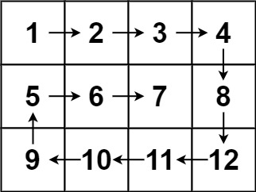

 # [Practice Problems](#practice-problems-1)
 # Two-Dimensional Arrays - Java and Python Implementations

 ## Introduction to Two-Dimensional Arrays
 A two-dimensional (2D) array is an array of arrays, where data is stored in rows and columns, resembling a table or matrix. It is indexed using two indices: `row` and `column`.

 ## Memory Storage of 2D Arrays
 In memory, a 2D array is stored in a linear fashion. The elements can be stored in two ways:
- **Row-Major Order**: Elements are stored row by row.
- **Column-Major Order**: Elements are stored column by column.

 ### Converting Multi-Dimensional Index to Linear Index
 Given a 2D array of size `rows × cols`, the linear index `L` for an element at position `(i, j)` (row index `i`, column index `j`) is computed as:

 **Row-Major Order:**
 \[ L = i \times \text{cols} + j \]

 **Column-Major Order:**
 \[ L = j \times \text{rows} + i \]

 **Examples:**
 Consider a 3×3 matrix:
 ```
  0  1  2
  3  4  5
  6  7  8
 ```
 In row-major order, the index of `mat[1][2]` is:
 \[ L = 1 \times 3 + 2 = 5 \]

 In column-major order, the index of `mat[1][2]` is:
 \[ L = 2 \times 3 + 1 = 7 \]

 **Converting Linear Index Back to (Row, Column) Pair**
 Given a linear index `L`, the row and column indices can be obtained as:
 **Row-Major Order:**
 \[ i = \frac{L}{\text{cols}}, \quad j = L \mod \text{cols} \]
 **Column-Major Order:**
 \[ i = L \mod \text{rows}, \quad j = \frac{L}{\text{rows}} \]

 ## Functions Implemented

 ### Java Implementation
 #### `sumAll(int[][] mat)`
 - Computes the sum of all elements in the matrix.
 ```java
 public static int sumAll(int[][] mat) {
     int sum = 0;
     for (int i = 0; i < mat.length; i++) {
         for (int j = 0; j < mat[i].length; j++) {
             sum += mat[i][j];
         }
     }
     return sum;
 }
 ```

 #### `columnSum(int[][] mat)`
 - Computes and prints the sum of each column.
 ```java
 public static void columnSum(int[][] mat) {
     int[] arr = new int[mat[0].length];
     for (int j = 0; j < mat[0].length; j++) {
         for (int i = 0; i < mat.length; i++) {
             arr[j] += mat[i][j];
         }
     }
     System.out.println(Arrays.toString(arr));
 }
 ```

 #### `rowSum(int[][] mat)`
 - Computes and prints the sum of each row.
 ```java
 public static void rowSum(int[][] mat) {
     for (int i = 0; i < mat.length; i++) {
         int sum = 0;
         for (int j = 0; j < mat[i].length; j++) {
             sum += mat[i][j];
         }
         System.out.println(sum);
     }
 }
 ```

 #### `multiplyMatrix(int[][] matA, int[][] matB)`
 - Multiplies two matrices and prints the result.
 ```java
 public static void multiplyMatrix(int[][] matA, int[][] matB) {
     int[][] result = new int[matA.length][matB[0].length];
     for (int i = 0; i < matA.length; i++) {
         for (int j = 0; j < matB[0].length; j++) {
             for (int k = 0; k < matB.length; k++) {
                 result[i][j] += matA[i][k] * matB[k][j];
             }
         }
     }
     printMatrix(result);
 }
 ```

 #### `printDiagonal(int[][] mat)`
 - Prints the main diagonal elements.
 ```java
 public static void printDiagonal(int[][] mat) {
     for (int i = 0; i < mat.length; i++) {
         System.out.println(mat[i][i]);
     }
 }
 ```

 ## Applications of 2D Arrays
 - **Image Processing:** Pixels in images are stored in a 2D array.
 - **Graph Representations:** Adjacency matrices store graph edges.
 - **Game Development:** Chess boards and grids use 2D arrays.
 - **Scientific Computing:** Data tables in simulations.
 - **Matrix Operations:** Fundamental to machine learning.
---
# Practice-Problems

## Question 1

**Problem:**
Create a function that takes a 2D matrix and a target value as input and returns `True` if the target value exists in the matrix, otherwise returns `False`.

**Example 1:**

```
Input:
matrix =
|  1 |  4 |  7 | 11 | 15 |
|  2 |  5 |  8 | 12 | 19 |
|  3 |  6 |  9 | 16 | 22 |
| 10 | 13 | 14 | 17 | 24 |
| 18 | 21 | 23 | 26 | 30 |

target = 5
Output:
True
```

**Example 2:**

```
Input:
matrix =
|  1 |  4 |  7 | 11 | 15 |
|  2 |  5 |  8 | 12 | 19 |
|  3 |  6 |  9 | 16 | 22 |
| 10 | 13 | 14 | 17 | 24 |
| 18 | 21 | 23 | 26 | 30 |

target = 99
Output:
False
```

---

## Question 2

**Problem:**
Create a function that takes two matrices of the same shape as input and returns their summation matrix.

**Example 1:**

```
Input:
Matrix1 =
| 2 | 2 | 1 |
| 1 | 5 | 0 |
| 0 | 0 | 1 |

Matrix2 =
| 5 | 7 | 1 |
| 0 | 3 | 0 |
| 1 | 0 | 8 |

Output:
Resulted_Matrix =
| 7 | 9 | 2 |
| 1 | 8 | 0 |
| 1 | 0 | 9 |
```

---

## Question 3

**Problem:**
Write a function to calculate the sum of the main diagonal elements of a square matrix.

**Example 1:**

```
Input:
matrix =
| 1 | 2 | 3 |
| 4 | 5 | 6 |
| 7 | 8 | 9 |

Output:
15
```

---

## Question 4

**Problem:**
Create a function that takes two matrices as input and multiplies those two matrices. Return the resulting matrix.

**Example 1:**

```
Input:
matrix1 =
| 1 | 2 | 3 |
| 4 | 5 | 6 |

matrix2 =
| 10 | 11 |
| 20 | 21 |
| 30 | 31 |

Output:
resulted_matrix =
| 140 | 146 |
| 320 | 335 |
```

---

## Question 5

**Problem:**
Write a function that takes a 2D matrix as input. If any element in the matrix is 0, the function should set all elements in that element's row and column to 0. The changes should be made directly to the original matrix (in-place).

**Example 1:**

```
Input:
matrix =
| 1 | 1 | 1 |
| 1 | 0 | 1 |
| 1 | 1 | 1 |

Output:
resulted_matrix =
| 1 | 0 | 1 |
| 0 | 0 | 0 |
| 1 | 0 | 1 |
```

**Example 2:**

```
Input:
matrix =
| 1 | 2 | 0 |
| 4 | 5 | 6 |
| 7 | 8 | 9 |

Output:
resulted_matrix =
| 0 | 0 | 0 |
| 4 | 5 | 0 |
| 7 | 8 | 0 |
```

---

## Question 6

**Problem:**
Create a function that takes a 2D matrix as input and returns an array of its boundary elements in the order they are encountered during a boundary traversal. The traversal should start from the top-left corner and go clockwise.

**Example 1:**

```
Input:
matrix =
|  1 |  2 |  3 |  4 |
|  5 |  6 |  7 |  8 |
|  9 | 10 | 11 | 12 |
| 13 | 14 | 15 | 16 |

Output:
[1, 2, 3, 4, 8, 12, 16, 15, 14, 13, 9, 5]
```

---

## Question 7

**Problem:**
Create a function that takes a 2D square matrix as input and modifies it to become its transpose in-place.

**Example 1:**

```
Input:
matrix =
| 1 | 2 | 3 |
| 4 | 5 | 6 |
| 7 | 8 | 9 |

Output:
transposed_matrix =
| 1 | 4 | 7 |
| 2 | 5 | 8 |
| 3 | 6 | 9 |
```

---

## Question 8

**Problem:**
Create a function that takes an n×n 2D matrix representing an image and rotates the image by 90 degrees clockwise. The rotation should be done in-place.

**Example 1:**

```
Input:
image =
| 1 | 2 | 3 |
| 4 | 5 | 6 |
| 7 | 8 | 9 |

Output:
rotated_image =
| 7 | 4 | 1 |
| 8 | 5 | 2 |
| 9 | 6 | 3 |
```

## Question 9
**Problem:**
Spiral Matrix Traversal

 **Problem Statement**

 Given an `m x n` matrix, return all the elements of the matrix in **spiral order**.

 Start from the top-left corner and move:
 1. **Right** across the top row,
 2. **Down** the last column,
 3. **Left** across the bottom row,
 4. **Up** the first column.

 Repeat this process inward layer by layer until all elements are traversed.

 ---
 ### Example 1


 **Input:**
 ```java
 matrix = [
   [1, 2, 3],
   [4, 5, 6],
   [7, 8, 9]
 ]
 ```

 **Output:**
 ```java
 [1, 2, 3, 6, 9, 8, 7, 4, 5]
 ```

 ---

 ### Example 2

 

 **Input:**
 ```text
 matrix = [
   [1, 2, 3, 4],
   [5, 6, 7, 8],
   [9, 10, 11, 12]
 ]
 ```

 **Output:**
 ```text
 [1, 2, 3, 4, 8, 12, 11, 10, 9, 5, 6, 7]
 ```

 ---

 ### Constraints
 - `m == matrix.length`
 - `n == matrix[i].length`
 - `1 <= m, n <= 100`
 - `-100 <= matrix[i][j] <= 100`

 ---

 Implement a function:
 that returns all elements of the matrix in spiral order.


